Exercise 1
=====================================================================

1.1 - Create a Project
^^^^^^^^^^^^^^^^^^^^^^^^^^^^^^^^^^
* Create New Project named Frabitztown

.. figure:: images/1.png
   :scale: 25 %
   :align: center

.. figure:: images/2.png
   :scale: 25 %
   :align: center

1.2 - Create a Model System
^^^^^^^^^^^^^^^^^^^^^^^^^^^^^^^^^^
* Create New Model System name Exercise 2

.. figure:: images/3.png
   :scale: 25 %
   :align: center

.. figure:: images/4.png
   :scale: 25 %
   :align: center

.. figure:: images/5.png
   :scale: 25 %
   :align: center

1.3 - Create a Root Module
^^^^^^^^^^^^^^^^^^^^^^^^^^^^^^^^^^
* Click on the root module and either press Ctrl+M or right click and select Set Module.
* Search for the module type “BasicTravelDemandModule”
* Double click on the Module type “BasicTravelDemandModel” or press “Enter”
* Press Shift+F2 or right click and select “Edit Description” and write down the description “Trip Generation”

.. figure:: images/6.png
   :scale: 25 %
   :align: center

.. figure:: images/7.png
   :scale: 25 %
   :align: center

.. figure:: images/8.png
   :scale: 25 %
   :align: center

•	Download Input from [insert link here] and extract them

1.4 - Setting the Base Directory
^^^^^^^^^^^^^^^^^^^^^^^^^^^^^^^^
•	Set model system input base directory
*	Select the module named “Exercise 2”
*	Select parameter “Input Base Directory”
*	Set the value to the location of the input directory

.. figure:: images/9.png
   :scale: 25 %
   :align: center

1.5 - Setting the Population Resource
^^^^^^^^^^^^^^^^^^^^^^^^^^^^^^^^
* Create the Population Resource
* Select the resources module
* Create Module of Type Resource
* Rename module to “Population”
* Change Parameter “Resource Name” to “Population”
* Change Data Source to ZoneInformation
* Change Reader to ReadOriginTextData
* Update Parameter “File Name” to “Population.csv”

.. figure:: images/10.png
   :scale: 25 %
   :align: center

.. figure:: images/11.png
   :scale: 25 %
   :align: center
   
.. figure:: images/12.png
   :scale: 25 %
   :align: center

.. figure:: images/13.png
   :scale: 25 %
   :align: center

.. figure:: images/14.png
   :scale: 25 %
   :align: center

.. figure:: images/15.png
   :scale: 25 %
   :align: center

.. figure:: images/16.png
   :scale: 25 %
   :align: center

.. figure:: images/17.png
   :scale: 25 %
   :align: center

.. figure:: images/18.png
   :scale: 25 %
   :align: center

1.5 - Copy the Population Resource
^^^^^^^^^^^^^^^^^^^^^^^^^^^^^^^^
* Click on the Population module and press Ctrl+C or right click and select “Copy”
* Click on “Resources” and paste by pressing Ctrl+V or right click and selecting “Paste”
* Click on the bottom Population and press F2 or right click and select “Rename”
* Type in “WorkParticipation” and then press Enter.
* Expand the module, and expand again the Data Source submodule
* Select Reader
* Change the parameter “File Name” to “WorkParticipationRate.csv”
* Click on the Population module and press Ctrl+C or right click and select “Copy”
* Click on “Resources” and paste by pressing Ctrl+V or right click and selecting “Paste”
* Click on last Population and press F2 or right click and select “Rename”
* Type in “EmploymentRate” and then press Enter.
* Expand the module, and expand again the Data Source submodule
* Select Reader
* Change the parameter “File Name” to “EmploymentRate.csv”

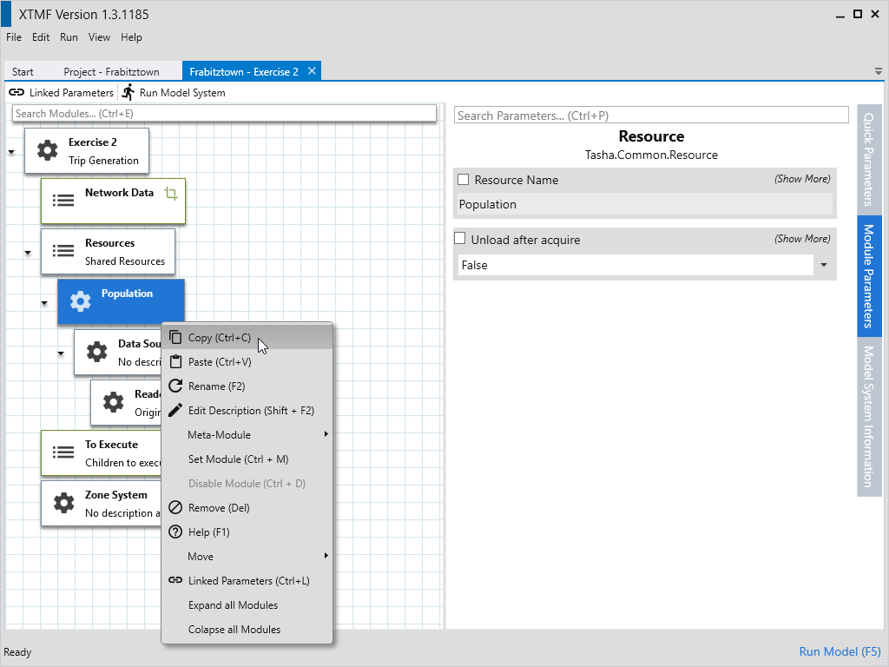

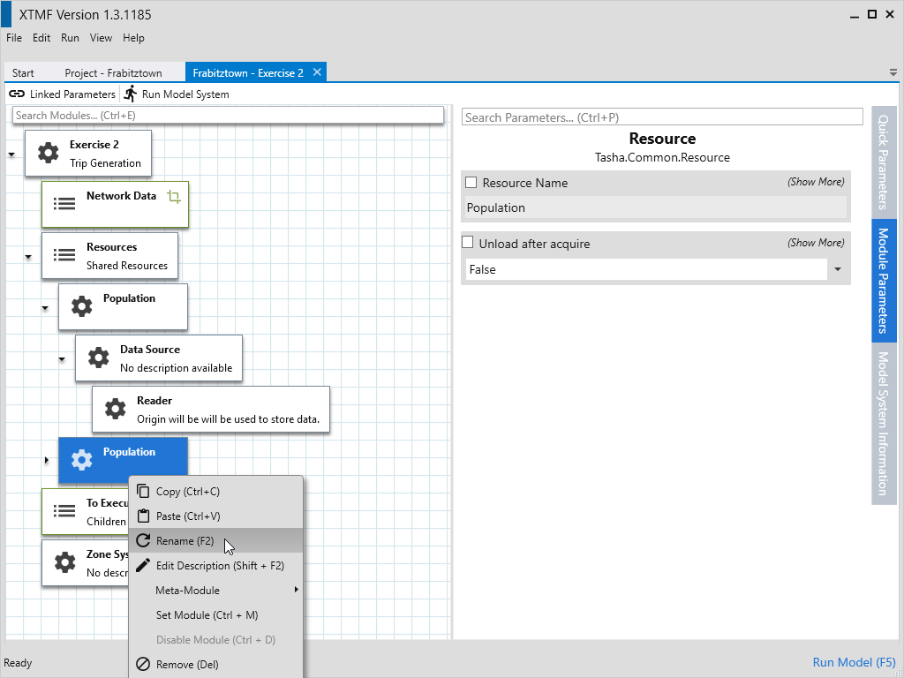

.. figure:: images/21.png
   :scale: 25 %
   :align: center

.. figure:: images/43.png
   :scale: 25 %
   :align: center

.. figure:: images/44.png
   :scale: 25 %
   :align: center

.. figure:: images/45.png
   :scale: 25 %
   :align: center

.. figure:: images/46.png
   :scale: 25 %
   :align: center

.. figure:: images/47.png
   :scale: 25 %
   :align: center

1.7 - Create Work Generation
^^^^^^^^^^^^^^^^^^^^^^^^^^^^^^^^
* Select Resources and add a new module by pressing Ctrl+M or by right clicking and selecting “Add Module”.
* Select the type “Resource”
* Rename the module “Work Generation”
* Change the parameter “Resource Name” to “WorkGeneration”
* Select sub-module Data Source.
* Set the module type to VectorMath by pressing Ctrl+M or right clicking and selecting “Set Module”
* Change the name of the module to “Compute Work Trips By Zone”
* Select Data Sources
* Add a new module by pressing Ctrl+M or right clicking and selecting “Add Module”
* Search and select the type “RemoteDataSource`1” a second window will come up asking for the sub-type.  Search for and select the type “DataStructure.SparseArray`1”.  Another window will come up for the subtype of the SparseArray.  Now search and select the type “System.Single”.
* Rename this module “Population”
* Change the parameter “Resource Name” to “Population”
* Copy Population and paste it into Compute Work Trips By Zone’s Data Sources.
* Rename the second copy of Population to “WorkParticipation”
* Change “WorkParticipations”’s parameter “Resource Name” to “WorkParticipation”
* Copy Population and paste it into Compute Work Trips By Zone’s Data Sources.
* Rename the second copy of Population to EmploymentRate
* Change “EmploymentRate”’s parameter “Resource Name” to EmploymentRate

.. figure:: images/22.png
   :scale: 25 %
   :align: center

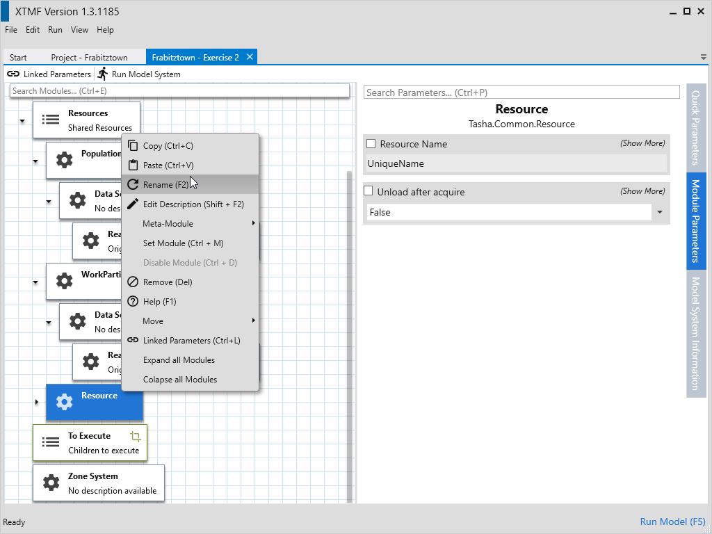

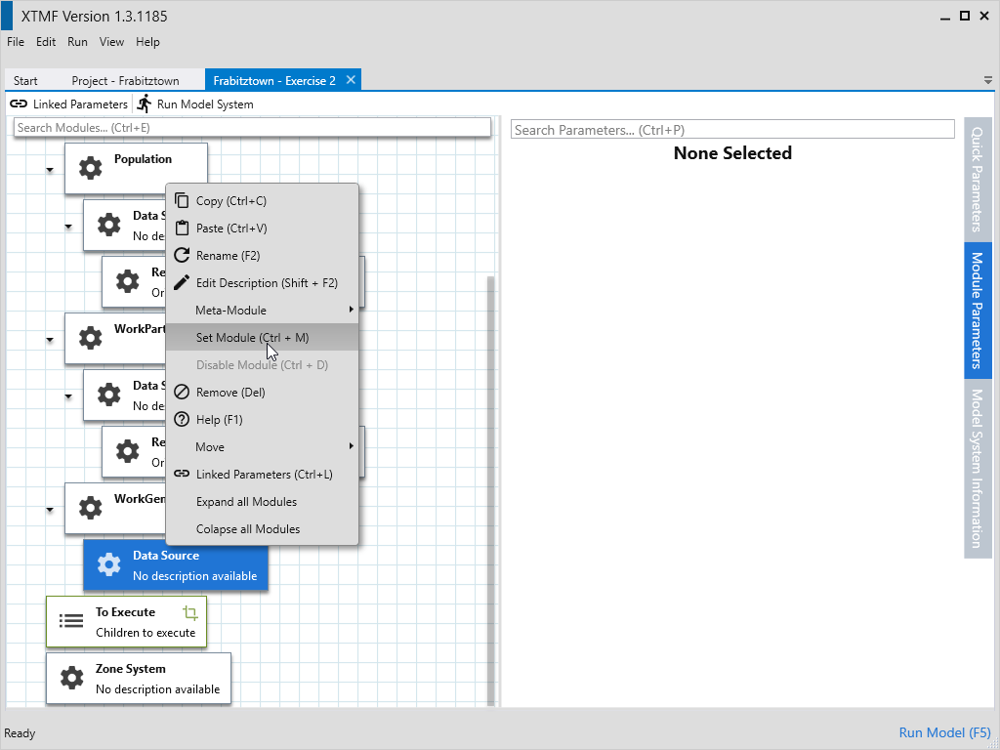

.. figure:: images/25.png
   :scale: 25 %
   :align: center

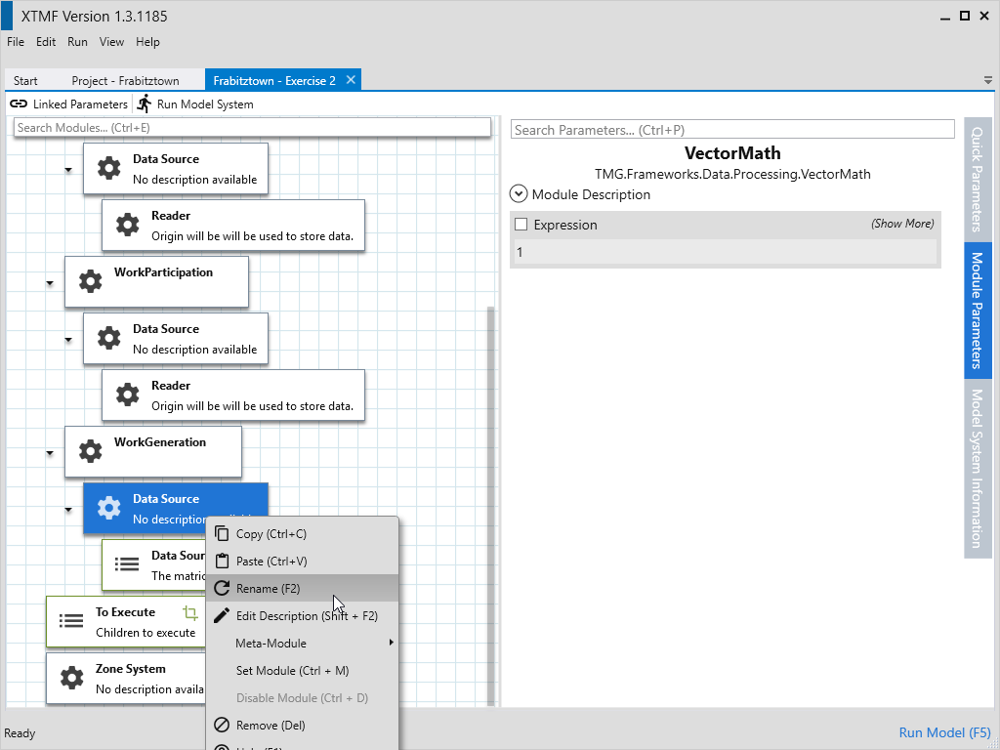

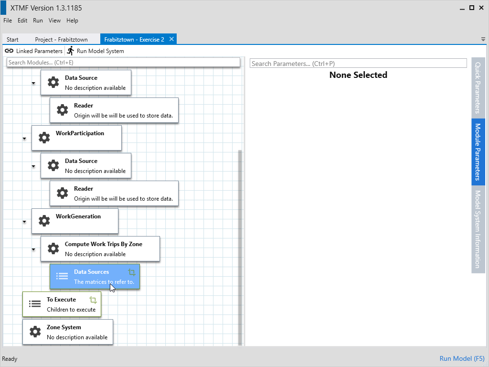

.. figure:: images/28.png
   :scale: 25 %
   :align: center

.. figure:: images/29.png
   :scale: 25 %
   :align: center

.. figure:: images/30.png
   :scale: 25 %
   :align: center

.. figure:: images/31.png
   :scale: 25 %
   :align: center

.. figure:: images/32.png
   :scale: 25 %
   :align: center

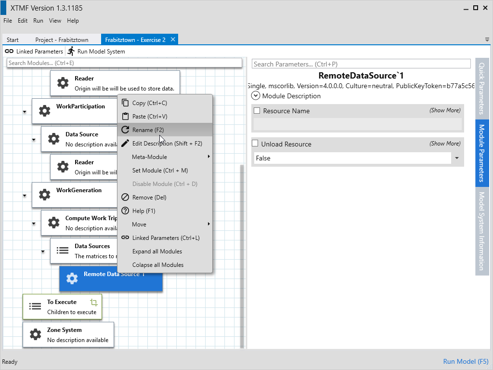

.. figure:: images/34.png
   :scale: 25 %
   :align: center

.. figure:: images/35.png
   :scale: 25 %
   :align: center

.. figure:: images/36.png
   :scale: 25 %
   :align: center

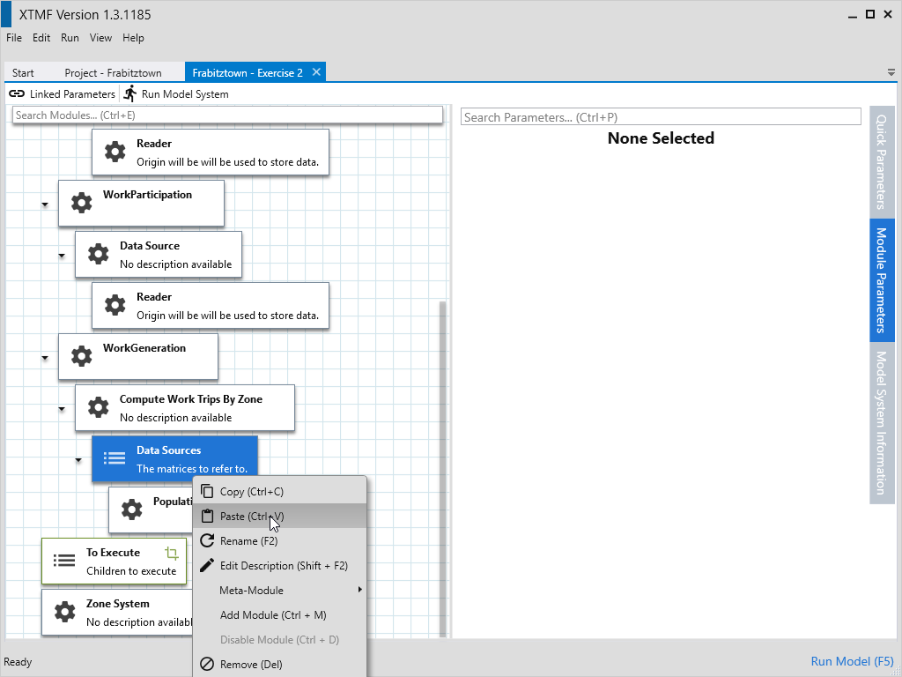

.. figure:: images/38.png
   :scale: 25 %
   :align: center

.. figure:: images/39.png
   :scale: 25 %
   :align: center

.. figure:: images/40.png
   :scale: 25 %
   :align: center

.. figure:: images/41.png
   :scale: 25 %
   :align: center

.. figure:: images/42.png
   :scale: 25 %
   :align: center

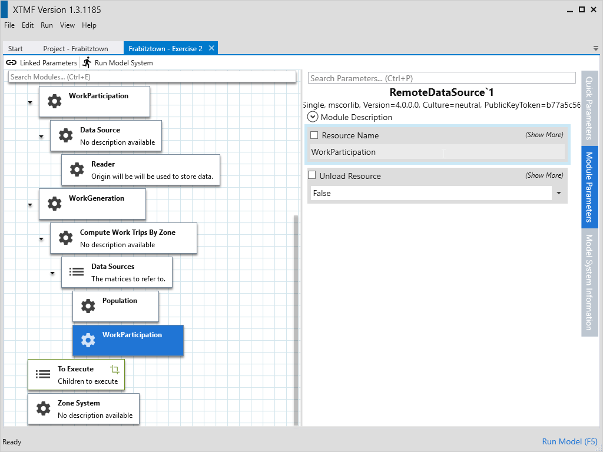

1.8 Calculate Work Generation Expression
^^^^^^^^^^^^^^^^^^^^^^^^^^^^^^^^^^^^^^^^^^^^^^^^^^^^^

* Select the module 'Compute Work Trips By Zone'
* Set expression to `Population * WorkParticipation * EmploymentRate`

.. figure:: images/48.png
   :scale: 25 %
   :align: center

1.9 Create Save Work Generation
^^^^^^^^^^^^^^^^^^^^^^^^^^^^^^^^^^^^^^^^^^^^^^^^^^^^^^^^^^^^^^^^^^^^^
* Select To Execute and add a module of the type “SaveSparseArrayToCSV”
* Select the created module and rename it to “Save Work Generation”
* Expand the module and select Data.
* Set the module type of Data to “ResourceLookup”
* Change the parameter “Resource Name” to “WorkGeneration”
* Select the module “Output To”
* Set the module type of “Output To” to "FilePathFromOuputDirectory".
* Change the value of the parameter “File From Output Directory” to “WorkGeneration.csv”
* Create Zone System
* Select the module named “Zone System”
* Set the module type to “ZoneRetriever”

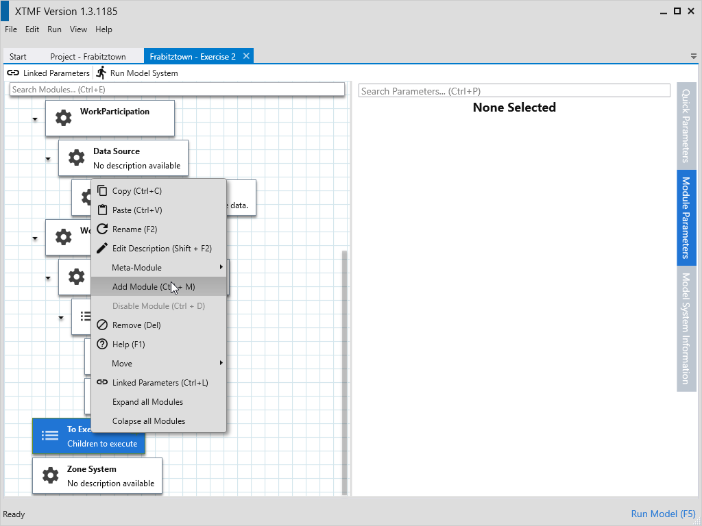

.. figure:: images/52.png
   :scale: 25 %
   :align: center

.. figure:: images/53.png
   :scale: 25 %
   :align: center

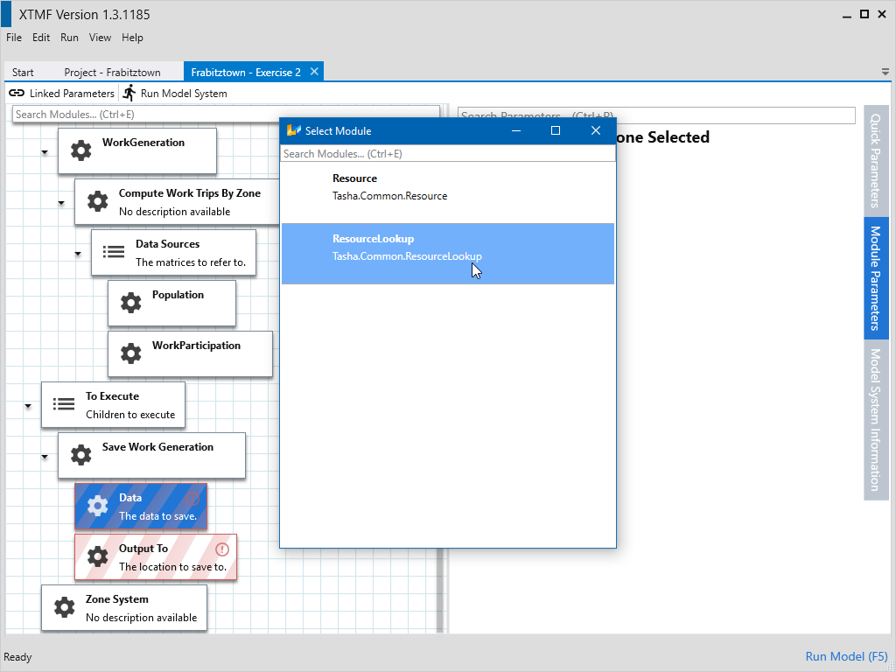

.. figure:: images/55.png
   :scale: 25 %
   :align: center

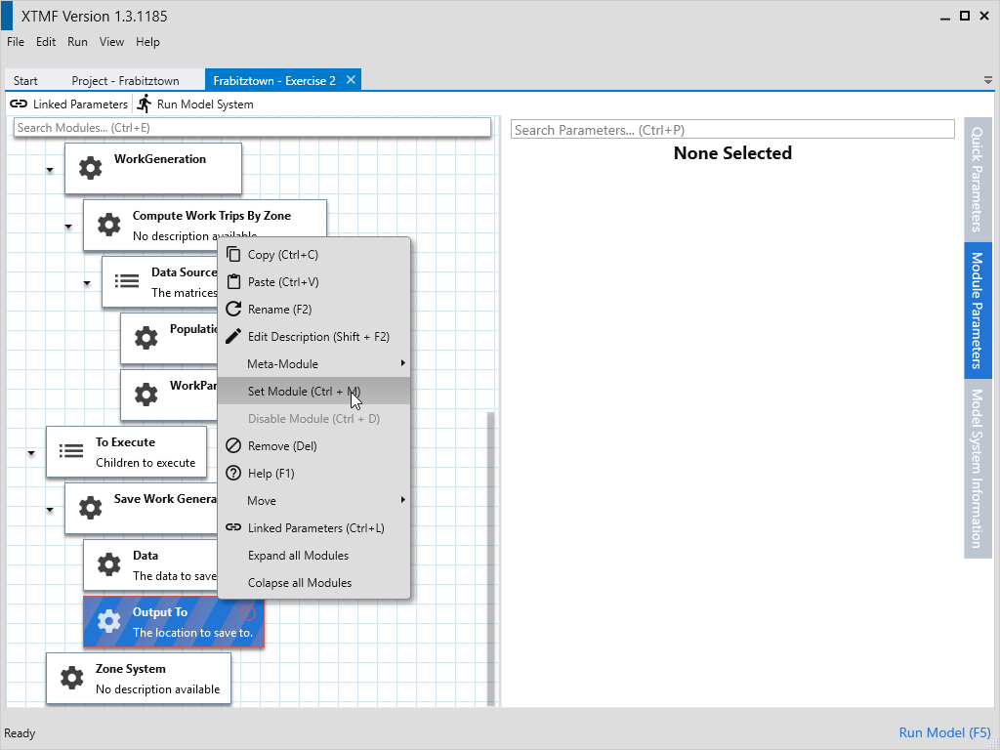

.. figure:: images/57.png
   :scale: 25 %
   :align: center

.. figure:: images/58.png
   :scale: 25 %
   :align: center

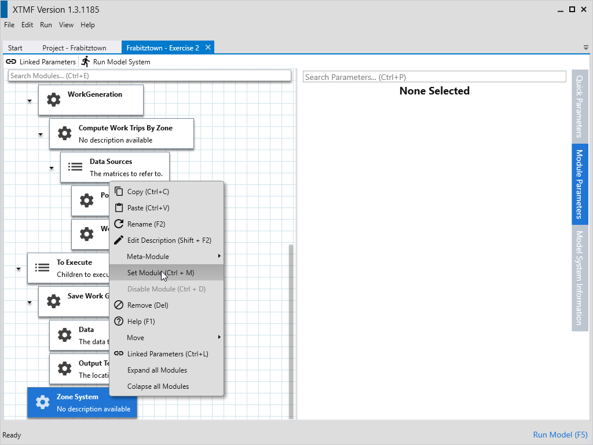

.. figure:: images/60.png
   :scale: 25 %
   :align: center

.. figure:: images/61.png
   :scale: 25 %
   :align: center

.. figure:: images/62.png
   :scale: 25 %
   :align: center