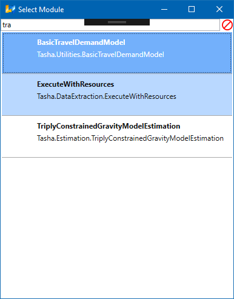

Setting up the Frabitztown Project and Model System in XTMF
**************************************************************************

Required Files and Assumptions
==========================================================================
This part of the XTMF documentation assumes that the provided Frabitztown input files have already
been downloaded and extracted.

  Note: Frabitztown input files can be accessed at: http://tmg.utoronto.ca/doc/1.3/frabitztown.zip

Creating the Project
==========================================================================
Once XTMF is opened click "New Project". Enter Frabitztown as the project name and press enter. When the project is created,
XTMF will automatically be redirected to the project page. The next step is to create a new model system that will be contained
within the "Frabitztown" project.

.. figure:: images/new_project.png
   :scale: 50 %
   :align: center

   Entering a name for a new project.

At the bottom of the project page, click the button that is labelled "Create New Blank Model System". Enter "Frabitztown" here again,
or another name of your choosing. Once you have chosen a name, click "OK" or press enter. A new model system will appear on the left
hand side of the project page. There will be a small disclaimer warning that the model system requires additional setup -- this indicates
that the model system is new and requires further setup to be in a runnable state.

.. figure:: images/new_model_system.png
   :scale: 50 %
   :align: center

   Entering a name for the new model system.

Starting the Frabitztown Model System Construction
-------------------------------------------------------------------------
With the Frabitztown project open in XTMF, double click the new Frabitztown model system that was made in the previous step. XTMF will now open
the model system in a new tab / page.

.. figure:: images/blank_model_system.png
   :scale: 50 %
   :align: center

   A blank model system.

The Frabitztown demo model system will make use of a module bundled as part of the main XTMF distribution. The module that will be used is called
"BasicTravelDemandModel". To make this the model system' root module, select and right click the cell with the description "The root of the model system" and choose
"Set Module" from the context menu. A small dialog window will appear initially with a large list of modules that can serve as a "root" of a model system. Modules cannot be placed arbitrarily into model systems - only valid modules can be put into their proper slots. The list of modules shown are all those loaded by XTMF
that can be the root of a model system. The filter text box can be used to quickly find the module being looked for. In this case, enter the first few characters of "BasicTravelDemandModel" to find it quickly. Double click the module to finally set it to the root of the model system.

   Choosing *BasicTravelDemandModel* from the 'Select Module' window.

Once the module type is chosen, the model system display will contain new items in the grid view. The BasicTravelDemandModel defines as its children 4 sections
of modules.

.. figure:: images/model_system_root.png
   :scale: 50 %
   :align: center

   The root of the Frabitztown model system - (with *BasicTravelDemandModel* set as the root
   module).

Setting the Input Directory
-------------------------------------------------------------------------------------
Typically a relative input directory needs to be set for model systems. Specifying an input directory makes it easier to refer
to files that need to be read-in. To set the base input directory, click on the module with description "The root of the model system". The right hand
panel of the model system page will have option to specify the input directory to use as a base for this *BasicTravelDemandModel*.

.. figure:: images/base_input_directory.png
   :align: center

   Choosing a base input directory from the root module parameter display.

This location should be pointed to the directory that contains the input contents for the model system.

Specifying the Zone System
========================================================================
The next step is to specify the zone system file for use in the *BasicTravelDemandModel*. The last child of the root module labelled "Zone System" is used to read-in
the zone system that will be used. Included with the Frabitztown documentation files is a file 'Zones.csv' - this file will be loaded by this module for use in the
model system. Clicking on the module will display the parameters view on the right hand side of the XTMF interface. This module's default parameter configuration
is generally in a prepared form by default.

The region file (child module of) of *Zone System* can be left blank for the purpose of the demo.

Establishing a connection with EMME
========================================================================
The next part of the model system creation process is to establish a resource that manages XTMF's connection to EMME. To start, begin by adding a new child
module under the module labelled "Resources". To do this, right click (or press ctrl + m with the module highlighted) and select the option [Add Module] from
the context menu. The parent module "Resources" is considered a *collection*. (ie: it can have multiple child modules). Select the child module just added to open
its list of parameters. Listed on the right there is a field called "Resource Name"; enter a descriptive name as an identifier for this module.

Next, a Data Source needs to be chosen for this resource. Since we are working with EMME, we want to set the module to *ModellerControllerDataSource*. This module allows
XTMF to reference an EMME instance for use during the run process. Once the data source is chosen, the next step is to point the EMME resource to the correct
project or input folder. Insert a *DirectorySeparatedPathFromInputDirectory* module into the Project Folder slot. Point the first parameter *DirectoryRelativeToInputDirectory* to the relative path of your input directory. The file name should point to the EMME project that will be loaded. Here Frabitztown
is entered for this demo.

.. figure:: images/emme.png
   :scale: 50 %
   :align: center

   Parameter display for choosing a path to the EMME project folder, along with the project file name.

Under the "To Execute" module, add a new child module with the type *Execute Tools From Modeller Resource*. This allows us to begin calling tools that are defined
within EMME or any loaded toolbox. From resource indicates that we will use the EMME resource defined earlier under the "Resources" module. When the module is expanded, assign "Resource Lookup" to the Emme Modeller child module. Once added, assign the unique name entered previously as the Resource Name.

   For more information regarding resources and their usage please see :ref:`Working with Resources`.

.. figure:: images/emme_modeller_resource.png
   :scale: 50 %
   :align: center

   Creating an EMME modeller resource.

1. Trip Generation
=============================================================================================
Part of the 4-Step model approach involves creating the productions and attractions for each analysis zone. 'Zones.csv' includes the relevant zonal data
to create this information. For simplicity, the attractions and productions of each zone was manually synthesized.

ZoneAttractions.csv
    This file contains the amount of attractions for each zone in third-normalized form.

ZoneProductions.csv
    This file contains the amount of productions for each zone in third-normalized form.

2. Trip Distribution
===========================================================================

Calculating Friction / Cost
----------------------------------------------------------------------------
Before moving onto the next section, there needs to be some preliminary work creating a cost matrix representing travel time ( in this guide ) between zones. Travel times between zones is calculated by inserting a 0 demand matrix in EMME for both auto and transit. The next steps
outline the preliminary set-up required to calculate the travel times for both auto and transit modes. A zero demand matrices are included as part
of input files.

Before XTMF can successfully call some of TMG Toolbox tools, some work must be done to prepare the network with attributes that are used in the assignment steps. .......... [ TO DO ]

Under the "Tools" module of *Execute Tools from Modeller Resource*, add a "Multi Class Road Assignment" module [1]. Under parameters, make sure to
set the Scenario ID (this is the scenario ID in EMME for the Frabitztown input provided). Next, add a child module[2] *Class* under *Classes*. Update
the parameter *Time Matrix* in the class module to 5.

.. figure:: images/multiclass_road_1.png
   :scale: 50 %
   :align: center

   [1] XTMF with the Multiclass road assignment module selected.

.. figure:: images/multiclass_road_2.png
   :scale: 50 %
   :align: center

   [2]XTMF with the single class road assignment module selected.

    Note: If the model system size becomes difficult to manage - remember to make use of the renaming (F2) and description (Shit + F2) commands that are available. Overriding modules names and descriptions can be useful for
    navigating the model system.

Exporting EMME matrices to file.
-----------------------------------------------------------------------------------

For sake of clarity, this tutorial includes this step to demonstrate how information might be extracted from a model system
during a run process. Typically these "debug" steps can be ignored in a production ready model system.

.. figure:: images/export_auto_emme.png
   :scale: 50 %
   :align: center

   [3] A module for exporting the in vehicle travel time matrix.

.. math::

	\beta^1_{tivtt} = 0.03 \\
	\beta^2_{aivtt} = 0.02
	\\
	e^{\beta{tivtt} + \beta{aivtt}}

Calculating Cost / Friction Matrix with ODMath
---------------------------------------------------------------------------

Begin by scrolling to the top of the model system tree. Under resources, add a new module of type *Resource* and set its data source
to the module of type *ODMath*. ODMath provides a useful set of tools to perform basic mathematical processing.

   For a more detail introduction to ODMath, please see [OD math]

The output of OD Math will be the final cost matrix that will be used to generate trip distributions with a gravity model. Under the
*Data Sources* module list, add two new *Zone O D Information* modules. Select their Reader as *LoadODDataFromCSV* and point one to
BaseTransitDemandMatrix.csv.csv and the other to BaseAutoDemandMatrix.csv. Set each Data source name with with right-click context
menu, or press F2 while the module is highlighted. Naming is required as the ODMath calculation performs resource / value lookup
based on the name of the module referenced in the equation string. Change the ODMath Resource's parameter to "e()^((0.02 * AUTO) + (0.03 * TRANSIT))".

Gravity Model
---------------------------------------------------------------------------
The main distribution of XTMF includes a module *GravityModel2D* that alleviates some of the process in calculating trip distribution matrices. This module can
take in zone attractions, productions and a cost (friction) function and output a distribution matrix for use in the mode choice step. The cost (friction) matrix for Frabitztown is the travel time between each zone. The GravityModel2D also includes options for balancing productions and attractions - so it is not necessary to balance
the matrix before calculating trip distributions.

.. math::

   T_{ij} = \frac{A_j f(C_{ij}) K_{ij}}{\sum_{j=1}^{n} A_j f(C_{ij}) K_{ij}}

Begin again my adding a "GravityModel2D" under Resources. For Attraction and Friction, use the ZoneProductions.csv and ZoneAttractions that are included with this guide's files as the input for those child modules. The Friction module should take the output from the previous step (*CostMatrix.csv*).

3. Mode Choice
====================================================================================
With trip distribution calculated, OD math can be utilized again to calculate mode choice. This guide uses a very simple utility function for transit and auto.

.. math:: P_m = \frac{e^{u_{ijm}}}{\sum{e^{u_{ijm}}}}

          {{u_{ij}}^{auto}} = 0.02 \times aivtt_{ij}

		  {{u_{ij}}^{transit}} = 0.03 \times tivtt_{ij}

Add two more child ODMath module under resources. This module will need to read in the trip distribution matrix CSV file output from the previous step. In addition to the trip distribution matrix, travel time for auto and transit modes will also be used as part of the calculation. In total, each ODMath resource will require three input matrices to perform mode choice.

.. figure:: images/auto_mode_choice.png
   :scale: 50 %
   :align: center

   ODMath mode choice calculation.

4. Network Assignment (with EMME)
=======================================================================================
The last stage of the 4-Step model is network assignment. XTMF provides the connectivity tools and modules
to to interface with EMME to perform network assignment.

Much of this last section is a general repeat (in fact, iteration) of some of the previous parts of trip distribution and mode choice. In general each iteration of network assignment calculates updated demand matrices for each
mode based on the previous iterations travel times. Over successive iterations, it as assumed that a balance will be
reached and the network assignment will approach equillibrium.

Modules that Iterate
------------------------------------------------------------------------------------------
The final parts of this model system are to find balance in the route assignment process. Begin by adding a child
module under the the Model System's *To Execute* module of type *Iteration*. Under the modules parameters, set "Execution Iterations" to 4. Execute in Parallel should be left as false. The iteration module allows sections
of the model system to be executed multiple times.

.. figure:: images/auto_mode_choice.png
   :scale: 50 %
   :align: center

   An iteration module.

Unloading Resources
^^^^^^^^^^^^^^^^^^^^^^^^^^^^^^^^^^^^^^^^^^^^^^^^^^^^^^^^^^^^^^^^^^^^^^^^^^^^^^^^^^^^^^^^^^^^^^^^
For an iteration to be capable of computing new values, those resources calculated and loaded in previous steps must
first be unloaded. This is required because *Resources* are calculated only once whenever they are first accessed
by an executing module. The calculated value is persisted until either an unload occurs or another run has started.

Under the iteration module, add child modules to *Iteration Modules* of type Resource for each of the resources
that were used in the previous steps.

#. CostMatrixResource
#. GravityModel2DResource
#. AutoDemandResource
#. TransitDemandResource

Iterating Assignment
^^^^^^^^^^^^^^^^^^^^^^^^^^^^^^^^^^^^^^^^^^^^^^^^^^^^^^^^^^^^^^^^^^^^^^^^^^^^^^^^^^^^^^^^^^^^^^^
Under Iteration modules, simply copy and paste the **Execute Tools from Modeller Resource** module
into iteration modules' children. Under the *Tools* module, remove the module that imported
the "0" demand matrix. This will need to be replaced with the new auto and travel time matrices
that have been calculated.

Add a module of type *ImportBinaryMatrixIntoEmmme* for both the auto and travel demand matrices. Remember
to set unique matrix numbers for both demand matrices. Import into Scenario 11. The import modules
should exist just under the *Extra Attribute Context Manager* module.

.. figure:: images/import_auto_demand.png
   :scale: 50 %
   :align: center

   Model System with import matrix into EMME active.

For both transit and auto assignment, the *Class* modules need to have a value set to for "Time Matrix". This is the
matrix that will be exported for EMME and used as part of the calculation to prepare updated inputs for the
next iteration. Set a unique value to both auto and transit. Make sure the field / property "Demand Matrix" is
set to the same matrix number used in the demand matrix import modules.

There should already exist two modules for exporting the new time matrices. If the corresponding matrix numbers do not
match, update them to the correct values that match the ones just created. Update the type from *ExportMatrix...*
to *ExportBinaryMatrixFromEmme* to export an .mtx file that will be used in the cost matrix resource.

Updating Travel Demand
^^^^^^^^^^^^^^^^^^^^^^^^^^^^^^^^^^^^^^^^^^^^^^^^^^^^^^^^^^^^^^^^^^^^^^^^^^^^^^^^^^^^^^^^^^^^^^^
This section can simply re-use the modules designed in the trip distribution stage. Each
iteration begins by calculating new travel demand matrices based on the updated *cost* values
that were output in the previous steps. While most of the modules here are similar to those previously
made, there are still some changes. Instead of reading in a "0" demand matrix - we will use the demand
matrices calculated each iteration. At the end of each iteration assignment, the updated time matrices
will be exported from EMME and fed back into (iterated) the trip distribution calculations.

This step will require recreating a new *CostMatrixResource* that reads in the network assignment's new
travel time outputs. Create a new resource based on the previous Cost Matrix calculation and set the inputs (reader) to use the .mtx files created in the previous step with *ReadEmme4BinaryMatrix*.

Under the children of "Iteration Modules", add a new module *SaveAsCSVMatrix* that will output a new cost matrix
as a CSV file in the output directory. Simply use the same cost matrix resource already created.

Next, the gravity model needs to be updated. Again, create a module with type *SaveAsCSVResource* that uses the previously made gravity model resource.

With the gravity model calculation completed, finally follow up with two modules that create a new output of the
Transit demand and Auto demand resources.

Running
========================================================================================================
Now that the model system has finally been completed, it is now time to perform a run. XTMF currently only supports a single run at any time. In order to perform multiple runs, the previous run must
first be completed.

Choosing a Run Name
------------------------------------------------------------------------------------------
With the model system page active (and focused) press either F5 or navigate to the main menu and find Run > Run Model System. A small dialog will appear asking to enter a name for the new run. Any string is acceptable, however make sure
to avoid reusing run names if you do not wish to overrwrite any previous output data. Run names are considered unique
and can only be used once unless you wish to overwrite previous results.

Understanding the Run Pane
------------------------------------------------------------------------------------------
