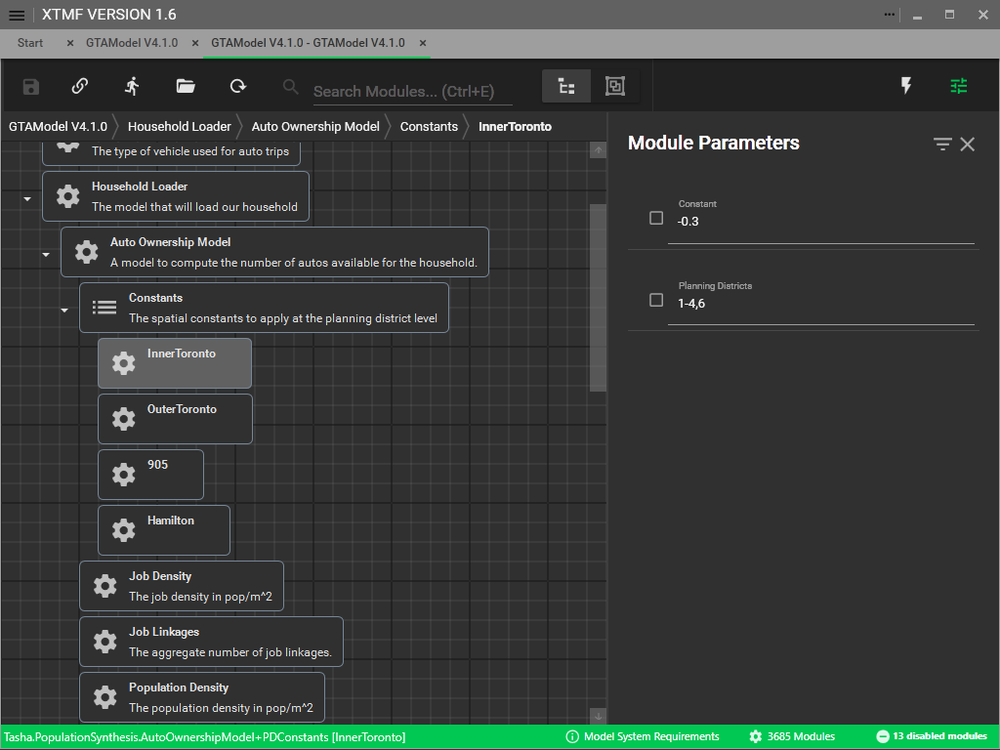

# Auto Ownership

`Available in GTAModel V4.1.0`

Once the Driver License model has been calibrated the next step is to calibrate the auto ownership
model.  Documentation for the model itself can be found
[here](../model_design/auto_ownership.md).  A constant can be added at the planning district
level, where a positive number will increase the probability that a higher number of cars
will be allocated to the households.

The results of the auto ownership model can be found in the [Microsim](../user_guide/file_formats/microsim.md)
data within the Households table.