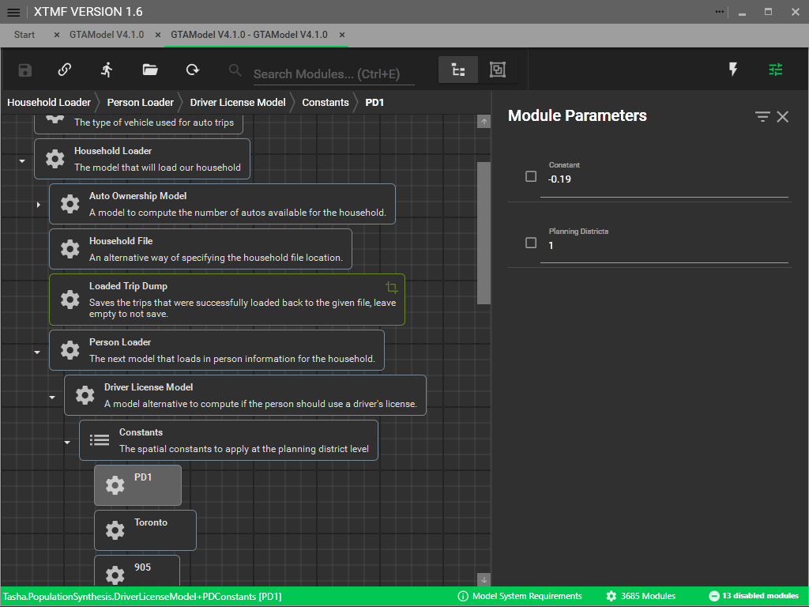

# Driver's License

`Available in GTAModel V4.1.0`

Once the PoRPoW models have been calibrated, the next step is to calibrate the
driver license model.  If you are not familiar with the model its documentation can be found
[here](../model_design/auto_ownership.md).

Below shows the location of the driver license model within the Person Loader. Increasing a
planning district's constant will increase the probability of people having a driver's license.

The results of the driver license model can be found in the [Microsim](../user_guide/file_formats/microsim.md)
data within the Persons table.