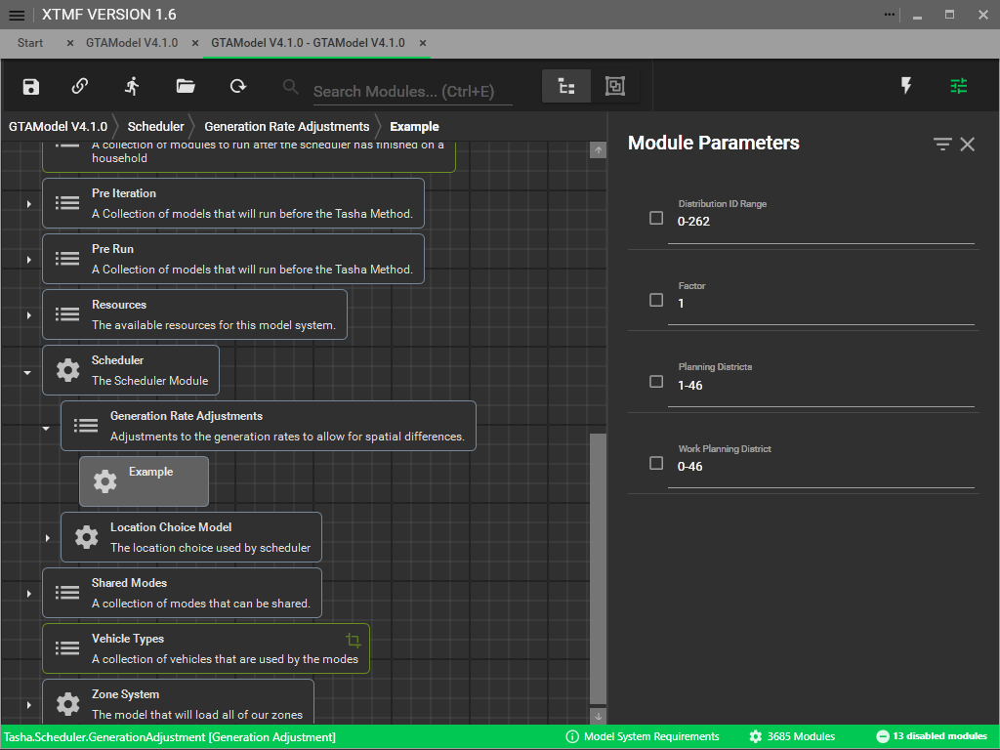

# Episode Generation

The episode generation for GTAModel is based on 262 different distributions
extracted from the TTS survey. 
 
> [!TIP]
> Documentation on how map Distribution IDs to activities can be found
> [here](../model_design/scheduler.md#generate-trip-chains).  

`Distribution ID Range` takes in a range set for the distributions you would like to modify.
`Factor` is a multiplier to assign to all non-zero frequencies, controlling the generation rate
but not changing the rate between the non-zero frequencies.
`Planning Districts` takes in a range set for the person's home zone.
`Work Planning District` takes in a range set for the person's work zone.  An
unemployed person 'works' in planning district 0.  If there are multiple generation rate
adjustments that cover the same activity distribution and home and work planning districts,
the adjustment that comes first in the list will be applied.

The results of episode generation can be found in the [Microsim](../user_guide/file_formats/microsim.md)
data within the Trips table.