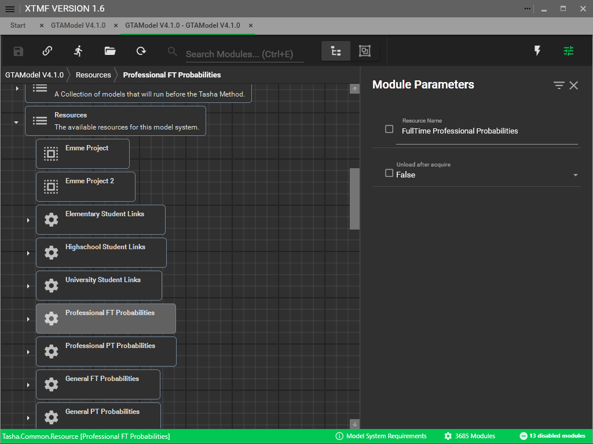
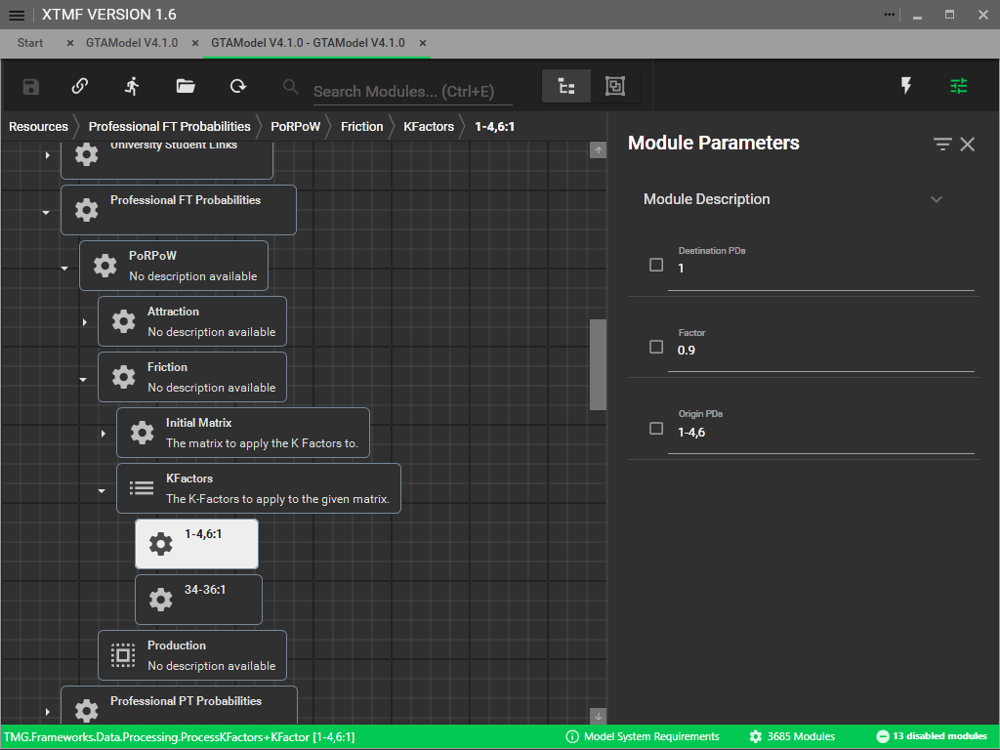
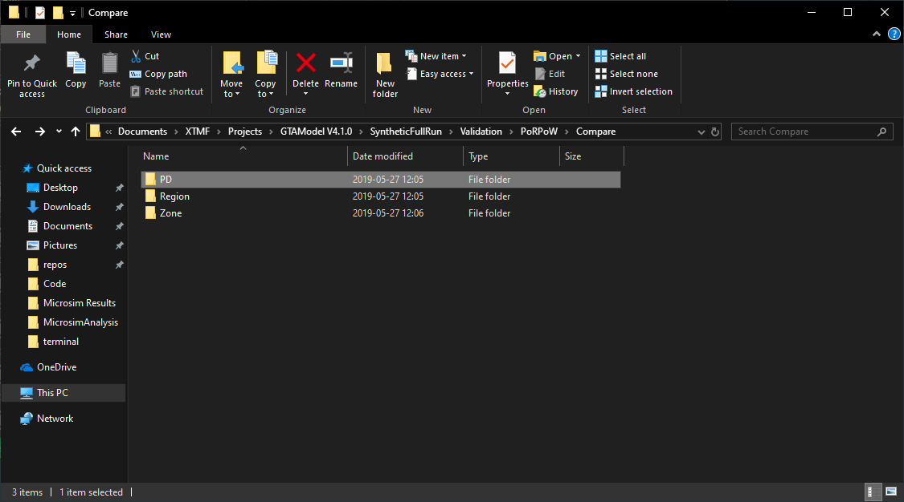

# Place-of-Residence Place-of-Work (PoRPoW)

After your [network assignment](transit_assignment.md) models are prepared and have generated the initial
level-of-service matrices, the next step is to calibrate the PoRPoW models.  Our calibration will
focus on the aggregate PoRPoW models, one for each occupation category and full-time / part-time
employment.  If you are not similar with these models please review their documentation
[here](../model_design/porpow.md).

You can find the PoRPoW modules in the Resource list, as shown below.

Inside of each PoRPoW model you will be able to assign a K-Factor between planning districts.
If a planning district OD is defined more than once, the K-Factors will be multiplied together.
For this model, origin refers to home zone, and destination refers to the work zone.

> [!Warning]
> If you have created additional planning districts you may need to update these K-Factors
> origin and destination planning districts to remain within the initial
> calibration provided by TMG.

In order to validate the results GTAModel V4.1 will save the results of the
final aggregate models to the output directory `Validation/PoRPoW/Compare/` in that
directory you will see three folders: PD, Region, and Zone.  Each of these directories
will have a matrix containing the \\( Model_{occemp} - TTS_{occemp} \\) at the given aggregation.

