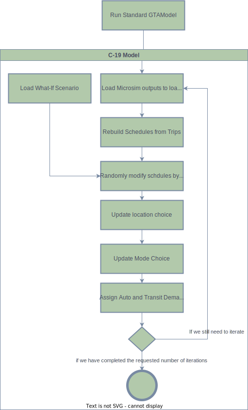

# C-19 Model

## Overivew

To help explore what-if scenarios inspired by the COVID-19 pandemic the Travel Modelling Group has designed an variant of GTAModel called C-19.  While we are lacking
enough information to create a new version of GTAModel to truly replicate the pandemic's conditions, this tool will allow you to modify the results of a previous
GTAModel V4.1+ run by taking in the results and modifying the population's schedules.  These modified schedules are then passed through location choice, mode choice, and assigned
to the network giving us updated road and transit conditions.

***Using the C-19 modules requires `XTMF 1.9+`.***

## Model Workflow

To run this model system you first start by running the "base conditions" using your existing GTAModel implementation.

<figure>
    
    <figcaption>Figure 1: Model Workflow</figcaption>
</figure>

## Additional Inputs

In addition to the rest of your Scenario inputs the C-19 model variants are designed to read in a new set of inputs that contain the probabilities
for an activity of that type to remain within the schedule.  Each of these files are the CSV format containing the columns `Zone` and `Rate`,
ordered respectively. For work activities the Zone represents the person's place of work, for other activities it represents their home zone.
For a description of the different activity types in GTAModel please refer to the [Scheduler's documentation](scheduler.md#activity-types).
Additionally, for the Primary Work activity episodes, the survival rates are divided by the person's occupation category.
Below are the following file names required for each scenario.

  * PrimaryProfessionalWork.csv
  * PrimaryGeneralWork.csv
  * PrimarySalesWork.csv
  * PrimaryManufacturingWork.csv
  * SecondaryWork.csv
  * WorkBasedBusiness.csv
  * School.csv
  * Other.csv
  * Market.csv

## Constructing the model system variant

  1. To modify your GTAModel implementation to support the C-19 variant you will need to first create a copy of your model system.
  2. Change your Household Loader to the type `TMG.Tasha.RemoveActivities`.
  3. Copy the Location Choice model from the `Scheduler` into the Household Loader's child module `Location Choice`.
  4. Set the `Main Loader` to type `TMG.Tasha.MicrosimLoader.LoadHouseholdsFromMicrosim`.
  5. Either set the parameter `Household Iterations` in the `Main Loader` to the number of household iterations that the mode choice is using
  or preferably link it to the Household Iterations Linked Parameter for your model system.
  6. Set the child modules of `Main Loader` to the appropriate [microsim files](../user_guide/file_formats/microsim.md).  We recommend using the
  `TMG.Input.DirectorySeperatedPathFromOutputDirectory` module for these links and set the `Directory Relative To Run Directory` to the `Microsim Results`
  output folder and then specifying the `File Name` appropriate to the individual module's file.
  7. Setup the activity survival rates in `TMG.Tasha.RemoveActivities` by setting the modules to use the type `Tasha.Data.ZoneInformation`.
  Then set the `Reader` to use `TMG.Data.Loading.LoadODDataFromCSV`, setting the parameter `Format`  to `ThirdNormalized` and `Read Type` to `Vector`.
  Set `Reader`'s `Load From` to `TMG.Input.DirectorySeperatedPathFromOutputDirectory`.  You will need to setup its parameters similarly to the
  `Microsim Results`'s, in this case though setting `Directory Relative To Input Directory` to the folder that contains the directory containing the rate scenario.
  You should then set it up with a new Linked Parameter so that it is easier to change during application later on. Finally set the `File Name` parameter to 
  the file name of the specific rate file in the scenario directory.
  8. Delete the `Scheduler` module now that the schedules will be modified by the `Household Loader`.
  9. In `Pre Iteration` delete `Place of Residence Place of School Gravity Model` since all of the school zones have already been assigned.
