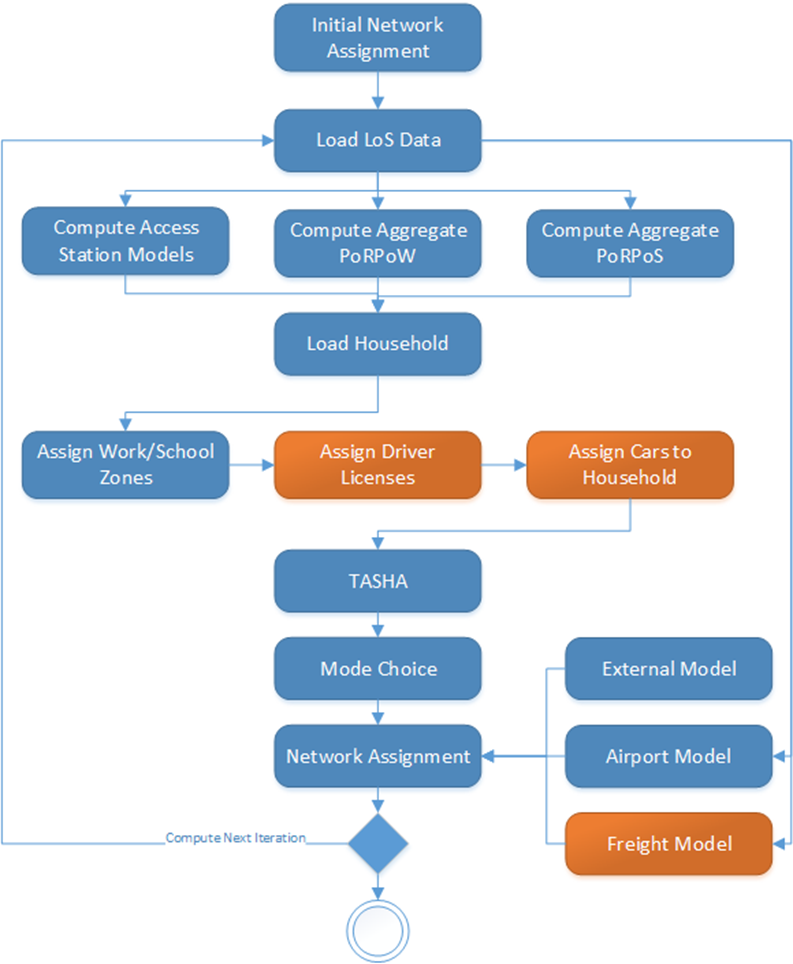

# GTAModelV4.0 Overview

GTAModel V4.0 is the next generation travel demand model platform developed by the Travel Modelling Group at the University of Toronto.  The model is designed to aid in the forecasting of travel patterns with the allowance of testing different policy decisions.  This version of GTAModel radically departs from its predecessors by moving both to an activity based design and an integrated daily model.  Five time periods are represented, AM, Mid-day, PM, Evening, and Overnight.  The work is largely based upon the Travel Activity Scheduler for Household Agents (TASHA) model written by Matthew J. Roorda.

GTAModelV4.0 has been designed to work within the eXtensible Travel Modelling Framework (XTMF), allowing it to be easily extended and customized by both TMG and consultants alike.  The model is property of the University of Toronto however, has been freely licensed to all funding agencies of TMG.  The code for the XTMF modules is open-source and is publicly available under the GPLV3 license as required by XTMF’s license.

Orange modules in _Figure 1_ are included in GTAModel V4.1+

_Figure 1 Model System Overview_ 