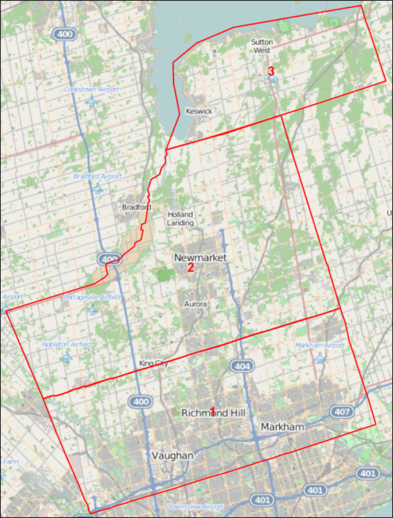

# Fare Schema File Specification

The new TMG implementation uses a fare schema file, implemented in Extensible Markup Language (XML). XML is a widely-used, hierarchical format which is human-readable. The fare schema file specification prescribes 3 collections of items necessary for generating the hyper-network: [groups](#groups), [zones](#zones), and [fare_rules](#fare-rules).

## Groups

Contains a list of transit line groupings. Conceptually, these groupings can be distinct transit agencies (e.g., TTC, GO Transit), but could also be distinct sub-groups of one agency (e.g. TTC Regular vs. TTC Downtown Express). It is important that ALL transit lines belong to a group to ensure proper behaviour when modelling transit. Also important to note is that each group will become its own “layer” in the hyper network generation procedure. Fewer groups reduces the size of the hyper network which, in trials, have surpassed maximum size allowed by the standard Emme license.

Each group element contains a set of transit line selector expressions (used by Emme’s Network Calculator) to select its lines. Groups are processed IN ORDER, so if a line meets the criteria for multiple groups, it will be assigned to the LAST group in the schema file. Each group must have a unique ID.

```xml
<group id="TTC Regular">
    <selection>line=T_____</selection>
</group>
<group id="TTC DT Express">
    <selection>line=T14___</selection>
</group>
```

## Station Groups (Station Centroids / Psuedozones)

An optional list of station group elements. Each station group element associates a set of network zone centroids with a line group. When doing so, “initial boarding” fare rules will be applied to links going from a station centroid directly to a stop of the associated line group. In this manner, trips departing from station centroids / psuedozones (which are often used in models to permit park-and-ride to transit) will accrue the correct initial boarding fare.

Each element has two attributes: for and selection. The former attribute associates the element with a line group; while the second selects which zones belong to the group. Note that each centroid can only be associated with a single line group; nodes selected more than once will be associated with the last station group loaded.

```xml
<station_group for="GO Transit" selection="i=9700,9800"/>
```

## Zones

An optional element containing a list of fare zones and a list of shapefiles. Each node in the network can be assigned to a single zone. If a node meets the requirements for multiple zones it will be assigned to the LAST zone in the schema file (similar to groups). Each zone must have a unique ID.

Two different types of fare zones are supported: node_selection and from_shapefile.  Node selection zones apply a set of node selector expressions (used by Emme’s Network Calculator). Zones loaded from shapefile reference an FID (feature ID) in one of the included shapefile elements. 

```xml
<shapefile id="1" path="D:/Workspace/GTAModelV4.1/Data/Fares/York_Region_Zones.shp" />
    
    <zone id="Toronto" type="node_selection">
    	<node_selector>i=10000,40000</node_selector>
    </zone>
    <zone id="York 1" type="from_shapefile">
    	<from_shapefile id="1" FID="1" />
    </zone>

```

## Fare Rules

Contains a list of fare rules to be applied to the hyper network once it has been generated. Each fare rule element has an associated cost and type, and sub-elements to determine which links or segments it applied to.

During processing, fare rules are applied in order; with each fare rule’s cost being added to its selected links or transit segments. This is an important distinction, as it allows fare rule costs to be negative, so long as the resulting summed value is greater than zero. 

For example, Hamilton Street Railway (HSR) has an initial fare of $1.65 , with a special “co-fare” of $0.50 to GO Transit, which discounts the initial fare when riders transfer to GO train stations using HSR. To model this, two fare rules are required:

* A fare of $1.65 applied to all links incoming to HSR’s “layer” of the transit network.
* A negative fare of $1.15 applied to links transferring from HSR to GO and from GO to HSR.

So, when egressing from GO to HSR, the on-link fare is $1.65 - $1.15 = $0.50, which is the appropriate co-fare. In the other direction, the discount is actually applied to the access-link to GO Transit, which uses an initial fare of $3.55. This works out to be $3.55 - $1.15 = $2.40; which is the resulting discount for transferring to GO. 

### Initial Boarding Rule (group, [in_zone])

Initial boarding rules have their cost applied to all LINKS inbound to the layer of the specified group. This rule can be further restricted to applying only to links starting from a specified ZONE.

```xml
<fare cost="2.22" type="initial_boarding">
    <group>TTC Regular</group>
</fare>

<fare cost="0.78" type="initial_boarding">
    <group>TTC Regular</group>
    <in_zone>York 1</in_zone>
</fare>
```

### Transfer (from_group, to_group, [bidirectional= False])

Transfer rules have their cost applied to all LINKS connecting one group’s layer to another’s. By default, this rule is applied one-way (to links ‘from’ to ‘to’) but can also be set to bidirectional (also applied to links ‘to’ to ‘from’).

```xml
<fare cost="-2.48" type="transfer">
	<from_group>HSR</from_group>
	<to_group>Burlington Transit</to_group>
</fare>

<fare cost="-1.18" type="transfer">
	<from_group>MiWay</from_group>
	<to_group>GO Transit</to_group>
	<bidirectional>True</bidirectional>
</fare>
```

### Zone Crossing Rule (group, from_zone, to_zone, [bidirectional= False])

Zone crossing rules have their cost applied to all SEGMENTS whose i-node belong to the specified from-zone and whose j-node belong to the specified to-zone, for the specified group. Like transfer rules, they too can be applied in a bidirectional fashion.

```xml

<fare cost="3.00" type="zone_crossing">
    <group>TTC Regular</group>
    <from_zone>Toronto</from_zone>
    <to_zone>York 1</to_zone>
</fare>

<fare cost="1.00" type="zone_crossing">
	<group>YRT</group>
	<from_zone>York 1</from_zone>
	<to_zone>York 2</to_zone>
	<bidirectional>True</bidirectional>
</fare>


```

### Distance In-Vehicle Rule (group)

Distance in-vehicle rules have their cost applied to all SEGMENTS belonging to their specified group. This cost is multiplied by the segment LENGTH attribute (inherited from the segment’s link) – in other words, the cost attribute is specified in $ per km.

```xml

<fare cost="0.0895" type="distance_in_vehicle">
    <group>GO Transit</group>
</fare>

```

# Usage and Performance

This section will cover how to use the above specification to generate new fare scenarios, as well as how to use the FBTN to run transit assignments. 

## Constructing New Fare Scenarios

The fare rule types specified in the Fare Schema File (FSF) can be combined to generate flexible fare scenarios to test. Fare costs are applied to two types of network elements – Links and Transit Segments – saved into user-specified Extra Attributes. Rules in the FSF are applied sequentially and additively; if a link or transit segment meets the criteria for multiple rules, the resulting value will be the sum of the costs. See Section 3.3 for an example of how these rules can be set up.

Internally, the tool indexes Links and Segments while creating the FBTN. Links are indexed into a table whose rows and columns correspond to the group number (where 0 represents the base network). For example, if the TTC is group 1, then the grid at [0, 1] contain all of the links from the base network to the TTC virtual layer. A similar table indexes Segments based on which zones they cross.

This framework leaves room for future extensibility, should new fare rule types be required.

## Limitations

There are limits to the types of fare rules that can be expressed using the above framework. Rules that are time-dynamic, that require information about the time that has elapsed since the beginning of a path, are not possible to model within Emme’s time-static framework. Rules which apply to different classes of passenger (e.g. student and/or senior fares) are not supported by this framework, although it might be possible to model using multiple Emme assignments. Finally, rules which require origin-to-destination information, or access-point-to-egress-point (e.g. GO transit fare zones) are not possible to model without access to the path-building algorithm, which Emme does not provide. However the last rules can be approximated using either in-vehicle distance or using zone-crossing rules.

## Transit Assignment

The generated FBTN is compatible with Emme Transit Assignment tools (Standard, Extended, Congested, etc.), although the Standard Transit Assignment cannot be used to run fare-based transit assignment (FBTA). It is easy enough to configure the Extended Transit Assignment tool (and the others) to run an FBTA: Use the Link Extra Attribute containing transfer fares and an Auxiliary transit cost (with the appropriate perception factor), and use the Transit Segment Extra Attribute containing in-vehicle fares as an In-vehicle cost (with the appropriate perception factor). See Figure 1 below for an example.


## Performance

There are no significant performance issues when using this tool. The FBTN generation procedure took approximately 30 seconds to run on the TMG machines. A non-FBTA was run on the resulting network and there were no noticeable lags in the performance.

An important detail to note: while developing this tool, TMG staff ran into issues with network size. The procedure required more nodes than a Size 13 license permitted. To address this issue, another tool was developed to reduce the node requirements by deleting mid-block nodes while preserving link attributes. Over 3,000 nodes were removed from the 2012 Base Network, which was sufficient to successfully run the FBTN generation procedure.

A separate tool to estimate the required network size has also been developed.

# Base Fare Schema

In creating the base fare schema file, the 2016 fares for every agency was first found by using the Operating Revenue per Passenger Trip. This is reported to CUTA by every transit agency, and is analogous to the average fare across all fare media and across all fare classes. Since GTAModelV4 is not expected to have different fare classes and fare media explicitly modelled, this amount is the most useful. The full base schema is transcribed in [Appendix A](#appendix-a-2016-fare-schema-file).

## Co-fares and Transfers

As some transit agencies offer a lower co-fare (or free) when transferring to and from other agencies, the negative-cost fare rules are implemented, where the initial boarding fare is subtracted from the co-fare to get the difference applied to the appropriate transfer links. These co-fares are documented in [Appendix B](#appendix-b-2016-full-fares). The overview of inter-agency fare transfer rules is summarized below:


## TTC Downtown Express, TTC Routes in York Region

The TTC operates a handful of premium routes as “Downtown Express” routes: 141, 142, 143, 144, and 145. In addition to the normal TTC initial boarding fare, an additional fare of $2.70 is required (if transferring from the TTC). Boardings from other agencies or first boardings are required the initial TTC fare plus the surcharge, which works out to be $4.68. A negative cost rule is applied when transferring from TTC to DT Express (and vice-versa) routes to account for having paid the TTC fare already.

Additionally, the TTC operates a number of routes north of Steeles Avenue, which is the official N/S boundary between Toronto and York Region. Passengers on-board pay an additional surcharge to cross in to or out from York Region. Within York Region, passengers pay YRT price for the initial boarding (the difference between YRT and TTC is $0.15), and must pay the surcharge when crossing Steeles.

## YRT Fare Zones

YRT divides York Region into three fare zones (1, 2, and 3). The boundaries between the fare zones are fairly wide (containing several stops), where the $1.00 surcharge is applied only if a passenger’s trip starts on one side of the fare boundary and ends on the other side. This “soft boundary” is not possible to model using Emme, since it involves knowing both end of the trip in advance (see GO Transit below), and so it is approximated using a “hard” zone crossing halfway through the soft boundary. Figure 2 below illustrates the location of each of the YRT fare zone boundaries. The boundary between Zone 1 and Zone 2 follows King Road, while the boundary between Zone 2 and Zone 3 follows Ravenshore Road. 



## GO Transit

GO Transit fares work on a zone system, where the cost of a ticket depends on which station one boards at and which station one alights at – the cost paid per ticket was provided as an origin-destination matrix. This is difficult to model from the route-choice perspective given the constructive nature of path-building. Therefore GO fares are approximated as a per-km fare, with an initial boarding fare. 

The initial fare comes directly from the fare matrix and is the minimum cost of a GO trip and also the cost of travelling within a single zone.

The per-km fare was estimated using linear regression, based on the network distance between fare zones; where the network distance is the minimum shortest path distance between GO stations/stops in each zone.  If between two zones there existed a path using just railway links, that path’s distance was used. Figure 3 shows the results of the linear regression.

The actual fares used in the estimation were blended across different fare media, since the given fares were for cash-only (the highest price). Data from Metrolinx indicated that 60% of GO riders paid using a PRESTO card, realizing a 17.5% discount on the ticket price. It was assumed that the remaining 40% of riders paid by cash. With this blending, the final applied initial boarding fare was $5.12, and the final per-km fare was $0.0895 (8.95 cents).


 

## Appendix A: 2016 Fare Schema File

```xml
<?xml version="1.0" encoding="utf-8"?>
<root>
  <version number="1.0" />

  <groups>
	<group id="GO Transit">
    	<selection>mode=rg</selection>
    </group>
    <group id="UPX">
    	<selection>line=GT08__</selection>
    </group>
    <group id="TTC Regular">
    	<selection>line=T_____</selection>
    </group>
    <group id="TTC DT Express">
    	<selection>line=T14___</selection>
    </group>
    <group id="DRT">
    	<selection>line=D_____</selection>
    </group>
    <group id="YRT">
    	<selection>line=Y_____</selection>
    </group>
    <group id="MiWay">
    	<selection>line=M_____</selection>
    </group>
    <group id="Brampton Transit">
    	<selection>line=B_____</selection>
    </group>
    <group id="Oakville Transit">
    	<selection>line=HO____</selection>
    </group>
    <group id="Burlington Transit">
    	<selection>line=HB____</selection>
    </group>
    <group id="Milton Transit">
    	<selection>line=HM____</selection>
    </group>
    <group id="HSR">
      	<selection>line=W_____</selection>
    </group>
  </groups>

  <zones>
    <shapefile id="1" path="York_Region_Zones\York_Region_Zones.shp" />
    
    <zone id="Toronto" type="node_selection">
    	<node_selector>i=10000,40000</node_selector>
    </zone>
    <zone id="York 1" type="from_shapefile">
    	<from_shapefile id="1" FID="1" />
    </zone>
    <zone id="York 2" type="from_shapefile">
    	<from_shapefile id="1" FID="0" />
    </zone>
    <zone id="York 3" type="from_shapefile">
    	<from_shapefile id="1" FID="2" />
    </zone>
  </zones>
  
  <fare_rules>
    <!--TTC (Toronto Transit Commission)-->
    <fare cost="2.22" type="initial_boarding">
    	<group>TTC Regular</group>
    </fare>
    <fare cost="4.44" type="initial_boarding">
    	<group>TTC DT Express</group>
    </fare>
    <fare cost="-2.22" type="transfer">
    	<from_group>TTC Regular</from_group>
    	<to_group>TTC DT Express</to_group>
    	<bidirectional>True</bidirectional>
    </fare>
    <fare cost="0.78" type="initial_boarding">
    	<group>TTC Regular</group>
    	<in_zone>York 1</in_zone>
    </fare>
    <fare cost="3.00" type="zone_crossing">
    	<group>TTC Regular</group>
    	<from_zone>Toronto</from_zone>
    	<to_zone>York 1</to_zone>
    </fare>
    <fare cost="2.22" type="zone_crossing">
    	<group>TTC Regular</group>
    	<from_zone>York 1</from_zone>
    	<to_zone>Toronto</to_zone>
    </fare>
    
    <fare cost="-3.00" type="transfer">
    	<from_group>TTC Regular</from_group>
    	<to_group>YRT</to_group>
    	<bidirectional>True</bidirectional>
    	<in_zone>York 1</in_zone>
    </fare> 
    
    <!-- GO Transit Fares -->
    <fare cost="5.12" type="initial_boarding">
    	<group>GO Transit</group>
    </fare>
    <fare cost="0.0895" type="distance_in_vehicle">
    	<group>GO Transit</group>
    </fare>
    <fare cost="2.55" type="initial_boarding">
    	<group>UPX</group>
    </fare>
    <fare cost="0.25" type="distance_in_vehicle">
    	<group>UPX</group>
    </fare>
    
    <!-- Durham Transit -->
    <fare cost="2.57" type="initial_boarding">
    	<group>DRT</group>
    </fare>
	<fare cost="-1.82" type="transfer">
		<from_group>DRT</from_group>
		<to_group>GO Transit</to_group>
		<bidirectional>True</bidirectional>
	</fare>
	
	<fare cost="-3.00" type="transfer">
		<from_group>DRT</from_group>
		<to_group>YRT</to_group>
	</fare>
	<!-- York Region -->
	<fare cost="3.00" type="initial_boarding">
		<group>YRT</group>
	</fare>
	<fare cost="-2.25" type="transfer">
		<from_group>YRT</from_group>
		<to_group>GO Transit</to_group>
		<bidirectional>True</bidirectional>
	</fare>
	<fare cost="1.00" type="zone_crossing">
		<group>YRT</group>
		<from_zone>York 1</from_zone>
		<to_zone>York 2</to_zone>
		<bidirectional>True</bidirectional>
	</fare>
	<fare cost="1.00" type="zone_crossing">
		<group>YRT</group>
		<from_zone>York 2</from_zone>
		<to_zone>York 3</to_zone>
		<bidirectional>True</bidirectional>
	</fare>
	<fare cost="-2.57" type="transfer">
		<from_group>YRT</from_group>
		<to_group>DRT</to_group>
	</fare>
	<fare cost="-2.48" type="transfer">
		<from_group>YRT</from_group>
		<to_group>Brampton Transit</to_group>
	</fare>
	<fare cost="-1.98" type="transfer">
		<from_group>YRT</from_group>
		<to_group>MiWay</to_group>
	</fare>
	<fare cost="-1.97" type="transfer">
		<from_group>YRT</from_group>
		<to_group>Oakville Transit</to_group>
	</fare>
	<fare cost="-2.53" type="transfer">
		<from_group>YRT</from_group>
		<to_group>Burlington Transit</to_group>
	</fare>
	<fare cost="-1.90" type="transfer">
		<from_group>YRT</from_group>
		<to_group>HSR</to_group>
	</fare>
	
	<!-- MiWay -->
	<fare cost="1.98" type="initial_boarding">
		<group>MiWay</group>
	</fare>
	<fare cost="-1.18" type="transfer">
		<from_group>MiWay</from_group>
		<to_group>GO Transit</to_group>
		<bidirectional>True</bidirectional>
	</fare>
	<fare cost="-2.48" type="transfer">
		<from_group>MiWay</from_group>
		<to_group>Brampton Transit</to_group>
	</fare>
	<fare cost="-1.97" type="transfer">
		<from_group>MiWay</from_group>
		<to_group>Oakville Transit</to_group>
	</fare>
	<fare cost="-2.53" type="transfer">
		<from_group>MiWay</from_group>
		<to_group>Burlington Transit</to_group>
	</fare>
	<fare cost="-1.90" type="transfer">
		<from_group>MiWay</from_group>
		<to_group>HSR</to_group>
	</fare>
	<fare cost="-3.00" type="transfer">
		<from_group>MiWay</from_group>
		<to_group>YRT</to_group>
	</fare>
	
	<!-- Brampton Transit -->
	<fare cost="2.48" type="initial_boarding">
		<group>Brampton Transit</group>
	</fare>
	<fare cost="-1.68" type="transfer">
		<from_group>Brampton Transit</from_group>
		<to_group>GO Transit</to_group>
		<bidirectional>True</bidirectional>
	</fare>
	<fare cost="-1.98" type="transfer">
		<from_group>Brampton Transit</from_group>
		<to_group>MiWay</to_group>
	</fare>
	<fare cost="-3.00" type="transfer">
		<from_group>Brampton Transit</from_group>
		<to_group>YRT</to_group>
	</fare>
	<fare cost="-1.97" type="transfer">
		<from_group>Brampton Transit</from_group>
		<to_group>Oakville Transit</to_group>
	</fare>
	<fare cost="-2.53" type="transfer">
		<from_group>Brampton Transit</from_group>
		<to_group>Burlington Transit</to_group>
	</fare>
	<fare cost="-1.90" type="transfer">
		<from_group>Brampton Transit</from_group>
		<to_group>HSR</to_group>
	</fare>
	
	<!-- Oakville Transit -->
	<fare cost="1.97" type="initial_boarding">
		<group>Oakville Transit</group>
	</fare>
	<fare cost="-1.22" type="transfer">
		<from_group>Oakville Transit</from_group>
		<to_group>GO Transit</to_group>
		<bidirectional>True</bidirectional>
	</fare>
	<fare cost="-2.48" type="transfer">
		<from_group>Oakville Transit</from_group>
		<to_group>Brampton Transit</to_group>
	</fare>
	<fare cost="-2.53" type="transfer">
		<from_group>Oakville Transit</from_group>
		<to_group>Burlington Transit</to_group>
	</fare>
	<fare cost="-1.98" type="transfer">
		<from_group>Oakville Transit</from_group>
		<to_group>MiWay</to_group>
	</fare>
	<fare cost="-1.90" type="transfer">
		<from_group>Oakville Transit</from_group>
		<to_group>HSR</to_group>
	</fare>
	<fare cost="-3.00" type="transfer">
		<from_group>Oakville Transit</from_group>
		<to_group>YRT</to_group>
	</fare>
	
	<!-- Burlington Transit -->
	<fare cost="2.53" type="initial_boarding">
		<group>Burlington Transit</group>
	</fare>
	<fare cost="-1.83" type="transfer">
		<from_group>Burlington Transit</from_group>
		<to_group>GO Transit</to_group>
		<bidirectional>True</bidirectional>
	</fare>
	<fare cost="-2.48" type="transfer">
		<from_group>Burlington Transit</from_group>
		<to_group>Brampton Transit</to_group>
	</fare>
	<fare cost="-1.90" type="transfer">
		<from_group>Burlington Transit</from_group>
		<to_group>HSR</to_group>
	</fare>
	<fare cost="-1.98" type="transfer">
		<from_group>Burlington Transit</from_group>
		<to_group>MiWay</to_group>
	</fare>
	<fare cost="-1.97" type="transfer">
		<from_group>Burlington Transit</from_group>
		<to_group>Oakville Transit</to_group>
	</fare>
	<fare cost="-3.00" type="transfer">
		<from_group>Burlington Transit</from_group>
		<to_group>YRT</to_group>
	</fare>
	
	<!-- Milton Transit -->
	<fare cost="2.55" type="initial_boarding">
		<group>Milton Transit</group>
	</fare>
	<fare cost="-1.85" type="transfer">
		<from_group>Milton Transit</from_group>
		<to_group>GO Transit</to_group>
		<bidirectional>True</bidirectional>
	</fare>
	
	<!-- HSR -->
	<fare cost="1.90" type="initial_boarding">
		<group>HSR</group>
	</fare>
	<fare cost="-1.30" type="transfer">
		<from_group>HSR</from_group>
		<to_group>GO Transit</to_group>
		<bidirectional>True</bidirectional>
	</fare>
	<fare cost="-2.48" type="transfer">
		<from_group>HSR</from_group>
		<to_group>Brampton Transit</to_group>
	</fare>
	<fare cost="-2.53" type="transfer">
		<from_group>HSR</from_group>
		<to_group>Burlington Transit</to_group>
	</fare>
	<fare cost="-1.98" type="transfer">
		<from_group>HSR</from_group>
		<to_group>MiWay</to_group>
	</fare>
	<fare cost="-1.97" type="transfer">
		<from_group>HSR</from_group>
		<to_group>Oakville Transit</to_group>
	</fare>
	<fare cost="-3.00" type="transfer">
		<from_group>HSR</from_group>
		<to_group>YRT</to_group>
	</fare>
  </fare_rules>
</root>

```

## Appendix B: 2016 Full Fares
