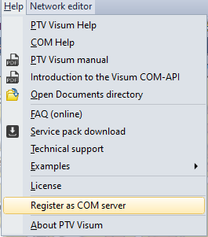

# Introduction

TMG.Visum is a set of libraries for interacting with Visum. Modules are compatible with
`XTMF 1.12+`. XTMF versions before 1.12 will not support these modules.
This library is similar to the TMGToolbox for EMME and TMGToolbox for Aimsun in that
it provides access to network assignment software.

Currently TMG.Visum is in active development with no release available at the moment.  We are targeting XTMF 1.13 for the first
release where this will be integrated into the main distribution.  Please follow [Setting up XTMF](#setting-up-xtmf) to see how to
manually setup TMG.Visum for XTMF1.12 or to integrate in the latest development build into your copy of XTMF.

## Setup

To starting working with PTV VISUM you will need to setup your XTMF build with new modules from TMG.Visum and make sure that
your Visum application has been registered as a COM server so XTMF can find it.

### Setting up XTMF

To enable TMG.Visum with your instance of XTMF1.12 you will need to copy `TMG.Visum.dll` and their respective `TMG.Visum-XTMF1.dll`
or `TMG.Visum-XTMF2.dll` into the `Modules` directory for your version of XTMF.

### Setting up Visum

In order for TMG.Visum to know which version of Visum it should connect to you will need to
set the corresponding version of Visum up as a COM server.  You can do this during the installation of Visum
or by selecting `Register as COM server` in the help menu inside of the Visum GUI.

<figure>
    
    <figcaption text-align="center">Figure 1: Selecting COM Server From Help Menu</figcaption>
</figure>

## Software Repository

There are four projects in the [TMG.Visum repository](https://github.com/TravelModellingGroup/TMG.Visum).
The first two (TMG.Visum and TMG.Visum.Test) provide 
an abstraction layer and testing to simplify the implementation for implementing modules in XTMF1 and XTMF2.

* [TMG.Visum](https://github.com/TravelModellingGroup/TMG.Visum/tree/main/TMG.Visum) -
     Contains an interface that abstracts VISUM and provides functionality for the other repositories to link to.
* [TMG.Visum.Test](https://github.com/TravelModellingGroup/TMG.Visum/tree/main/TMG.Visum.Test) - 
    Contains and integration testing for TMG.Visum
* [TMG.Visum-XTMF1](https://github.com/TravelModellingGroup/TMG.Visum/tree/main/TMG.Visum-XTMF1) -
    Contains modules for XTMF1 that interface to PTV's Visum through TMG.Visum.
* TMG.Visum-XTMF2 - COMING SOON: Will contain modules for XTMF2 that interface to PTV's Visum through TMG.Visum.

Instructions for compiling the repository can be found [here](https://github.com/TravelModellingGroup/TMG.Visum).
