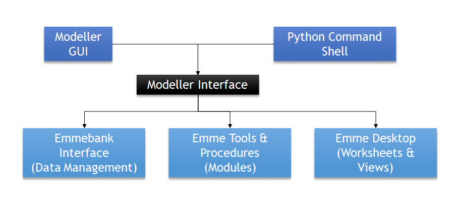

# How to write Emme tools
## Overview
The TMG toolbox in Emme is Python-based, of which the source code can be found at [GitHub](https://github.com/TravelModellingGroup/TMGToolbox). The tools are open-source licensed under GPL3 and can be accessed through Emme Modeller or XTMF.

> Modeller is a Python interface to Emme and its associated processes, which can be interacted with using its mouse-driven graphical interface (GUI) or using Python commands.<br />

<br />

Custom tools can be created for running through the Modeller GUI, simply by sub-classing `inro.modeller.Tool()`. A Tool is a Python object, it has
* a **`run()`** method which executes the tool's function
* a **`page()`** method which produces the tool's interface
* a **`__call__()`** method which works with XTMF

Tools can also be configured to report progress by implementing the `percent_completed(min, max, value)` method. 

> [!NOTE]
> For the tools to be called from **XTMF**, the attribute names used in the `__call__()` method need to be the same as in the parameter list. Four types of parameters are supported, which are `float`, `integer`, `string`, and `bool`. 

## Set up 
Tools or scripts for Emme begin with the loading of the modeller library:

`import inro.modeller as _m`

The Modeller Object is obtained through the library: 

`_M = _m.Modeller()`

The Modeller Object contains linkages to a particular Emme Project:

* to return an App object (Emme application), referring to the current Emme Desktop process:
`_M.desktop`

* to return an Emmebank object, referring to the active databank for the Emme Project:
`_M.emmebank`

* to return the currently-selected primary scenario:
`_M.scenario`

* to return the tool specified by the namespace argument:
`_emmetool =_M.tool(namespace='ToolNameSpace')`

* to return a library ('module'):
`_util = _M.module('tmg.common.utilities')` 

> [!NOTE]
>  **ToolNameSpace** is the full, unique name for a given INRO standard tool, which distinguishes it from third-party tools, such as the TMG Toolbox. An example will be `_ExtendedAssignmentTool =_M.tool('inro.emme.transit_assignment.extended_transit_assignment')`.
> 
> Modules in **tmg.common** folder contain a variety of helpful 'mini-functions' for Python scripting.

## Logbook
To write an entry to the Logbook, an example is as below. The optional value keyword argument accepts a string of HTML, which allows users to attach custom reports:
```
_m.logbook_write("Hello World", value=None)
```

To "indent" one level in the Logbook, use the `with` statement. All other logbook entries written inside the context will be subsequently indented:
```
with _m.logbook_trace("Trace level one"):
    _m.logbook_write("Logbook write level two")
```

> [!Tip]
> Modeller's **PageBuilder** object can be used to help generate HTML for reports to the Logbook. Reports can contain tables, charts, or even images of model results. Several tools in the TMG Toolbox produce reports to the Logbook.

## Tool Page Builder
The **`ToolPageBuilder`** is a class designed to facilitate building HTML interfaces for Tools.

In order for the Modeller GUI to set tool inputs, each input needs to be declared as an **`Attribute`**, with a given type ('declared').

The **`ToolPageBuilder`** can then be instructed to add inputs for each **`Attribute`**, with a variety of selection types: File browsers, text boxes, radio buttons, and comboboxes.

## Common Objects 
### Matrix & MatrixData
**Matrix** object is obtained through the Emmebank object. All matrix formats are supported, including Scalar, Origin, Destination, and Full matrices. The Matrix object itself includes metadata only, such as id, timestamp, type, and description. Actual matrix values must be accessed through the special **MatrixData** object.

> [!NOTE]
> Many INRO tools (such as the Matrix Calculator) only require the matrix ID, which is not the same as the Matrix object.

**MatrixData** object represents an in-RAM copy of matrix values (i.e. just the numbers but not the name). It can be obtained using `get_data(scenario_id=None)` method of a **Matrix** object, and can also be 'saved' back to the disk using the `set_data(matrix_data, scenario_id=None)` method of a **Matrix** object.

### Network
**Network** object is an in-RAM representation of an Emme network. It manages access, deletion, and creation of network elements, and does so very quickly (as compared to the Network Editor). 

In Emme, networks use a load/save system. **Network** objects are loaded into Python from a Scenario object using `get_network()`, and the Emme databank is not updated until the Network is saved into a Scenario using `publish_network()`.

There are 7 network elements, which can be accessed, iterated through, created, or removed from the **Network** object. Their relationship is as shown below:<br />

<br />

Each network element has a set of *standard* and *extra* attributes. For example, the *Link* object has the following *standard* attributes: length, type, num_lanes, volume_delay_func, data1, data2, and data3. *Extra* attribute values (which are started with '@') must be accessed using the `[attribute_name]` notation, since '@' is a special character in Python.

Example:

```
link_1 = network.link(20055,20056)

# to access the length of the link
length_link_1 = link_1.length
length_link_1 = link_1['length']

# to access an extra attribute of the link
toll_link_1 = link_1['@toll']
``` 

> [!Tip]
> **ExtraAttribute** objects are managed by the **Scenario** object, since each Emme scenario can have distinct sets of extra attributes.

Most tools which require an extra attribute input only require its ID, not the extra attribute object itself!


The **Node** object can represent both regular nodes and centroids, which can be distinguished using the `is_centroid` attribute (True for centroids, False otherwise). Similarly, `is_intersection` attribute can be used to flag nodes which are the k-node of a **Turn** object. The `vertices` attribute of **Link** objects contains a List of (x, y) tuples. Since tuples are immutable in Python, the only way to change link vertices is to replace them entirely.

**Segments** can be accessed in forward order (starting from 0) or in backwards order (starting with the hidden segment from -1). The `segments(include_hidden=False)` method is the only iterator method which accepts an argument. Namely, a Boolean flag to indicate whether the iterator should also include the final hidden segment. 

> [!NOTE] 
> * The`volume_delay_func` attribute references the ID of the link's VDF, not the **Function** object itself.
> * The **Network** object only supports deletion and creation of transit lines. There is currently no support for partial editing.


### Function
Databank functions also have corresponding objects in the Modeller API, and can be accessed from the **Emmebank** object using the `function()` method. All function types are represented, including:
- Volume-delay function (VDF)
- Transit time function (TTF)
- Turn penalty function (TPF)

## A Simple Tool Example

```
import inro.modeller as _m
_M = _m.Modeller()
_tmgTPB = _M.module('tmg.common.TMG_tool_page_builder')

class HelloWorld(_m.Tool()):
  version = '1.0.0'
  def __init__(self):
    self.Scenario = _M.scenario

  def page(self):
    pb = _tmgTPB.TmgToolPageBuilder(self, 
             title="Hello World v%s" % self.version,
             description="Prints out a Hello world for each entry point.",
             branding_text="- TMG Toolbox")
    return pb.render()

  def run(self):
    print "Hello World, Modeller!"

  def __call__(self, parameters):
    print "Hello World, XTMF" 
```

