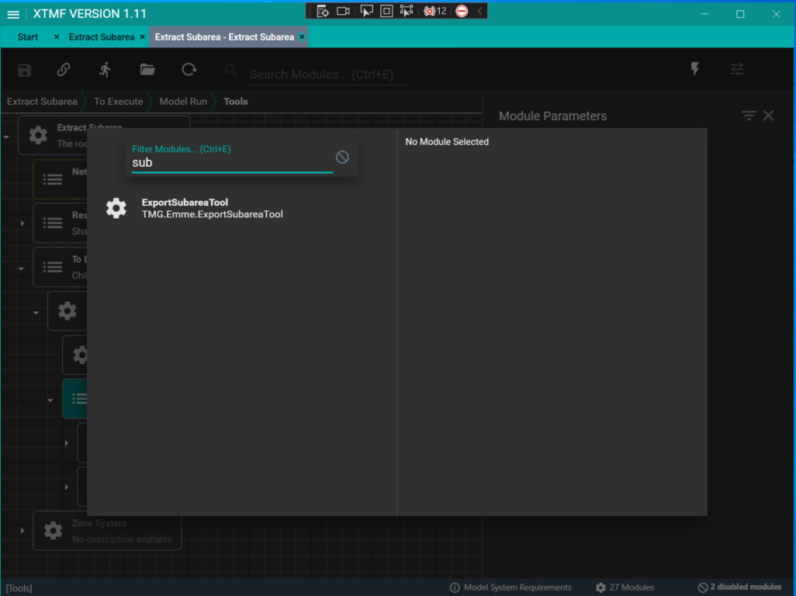
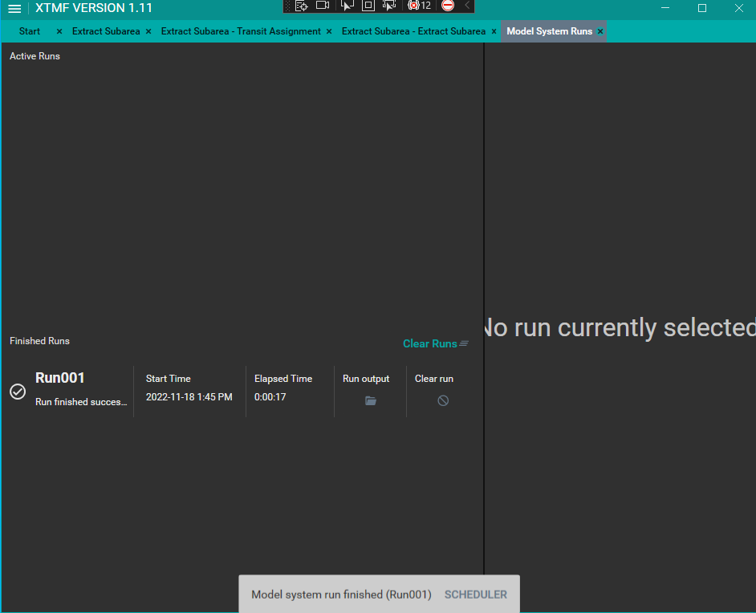
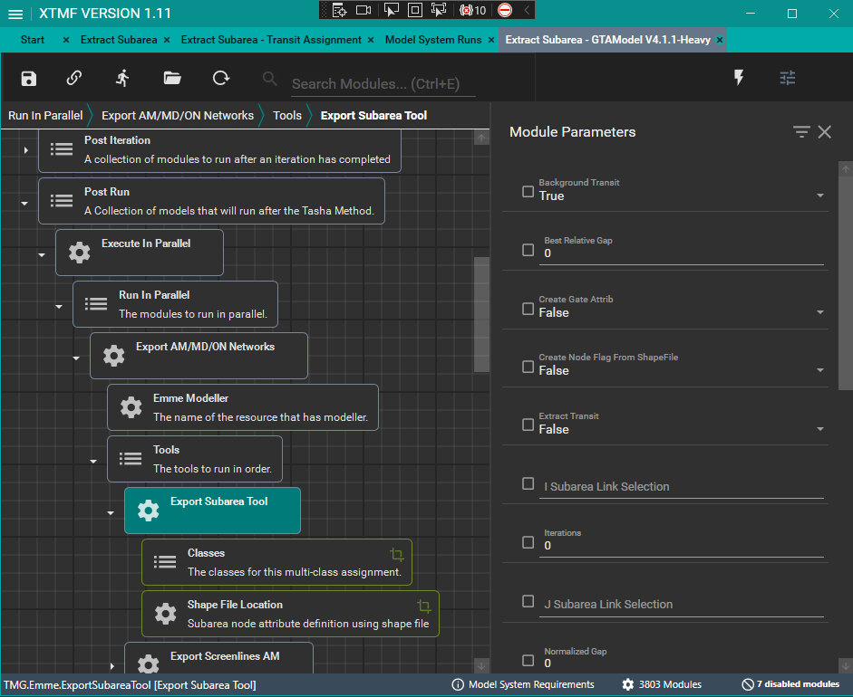

# **Export Subarea Tool**
The `ExportSubareaTool` exports the road network for a subarea as defined by the node attribute containing the subarea definition. For each class, the `ExportSubareaNetwork` tool extracts:

* the traversal demand matrices, 
* link volumes
* turn volumes 
* transit network (optional)
* traffic and transit traversal demand matrices  (optional)

This tool allows users to extract the road network for a subarea as well as the traffic demand matrices and link and turn volumes for a multi-class assignment. The transit network and demand may also be extracted if a transit assignment specification is provided.

To use the `ExportSubareaTool`, the user must specify either of the followings to define the subarea:
> * The node extra attributes within the subarea  that defines the subarea  (e.g., @nflag) 
> * the gates link extra attributes - i.e., the centroid connectors within the subarea and links crossing the boundary (e.g., @gate)

> [!NOTE]
Latest version of this tool includes the ability to:
> Optionally, use a polygon shapefile to create the node extra attribute that defines the subarea. There are various ways to create/define a subarea. If the subarea is already defined, set the Create Nflag From shapefile  to False.
> More details can be found in the Emme Help of *Subarea (Tool Category)* on defining the subarea from the regional model and *Subarea O-D matrix* on defining the gate labels.

## **Using the Tool with Modeller**
TMG's `ExportSubareaTool` is not callable from Emme Modeller. It is intended and only to be called from XTMF or via a python API call. However, INRO has a version of this tool in its Emme Standard Toolbox. To use this version in the Modeller, navigate to "Subarea" -> "Subarea".

The TMG tool can be found in "TMG Toolbox 1" -> "Input_output" -> "Export Subarea Tool" You can find the code for this tool [here](https://github.com/TravelModellingGroup/TMGToolbox/blob/dev/TMGToolbox/src/input_output/export_subarea_tool.py).

## **Using the Tool with XTMF**
The tool is called "ExportSubareaTool". It is available to add under ExecuteToolsFromModellerResource or EmmeToolsToRun. 

## **Tutorial - How to add the tool within XTMF**

Adding the `ExportSubareaTool` to XTMF GUI requires following the following step:

* Add the Export Subarea Tool Module to the Tools to execute or run in XTMF
* Enter all module parameters needed to run the tool. See module parameter explanation for "export subarea tool" below for more.
* Add all the class sub-module you want to run. You add as many as you want.
* Add sub-module parameter needed to run the tool. See sub-module parameter explanation for "Traffic Classes".
* Add shape file location sub-module and set the name of the shape file to use. This is required only if you want XTMF define a subarea based on a shapefile representing the subarea.
* Run model system

> [!NOTE]
The subarea tool can be added as many times (with a many classes as is needed)

Below contains details on how to add the tool to XTMF

**1. Add the Export Subarea Tool Module to the Tools to execute or run in XTMF**
<figure>
    
    <figcaption>Figure 1: Add Module</figcaption>
</figure>

<figure>
    
    <figcaption>Figure 2: Search for and ExportSubareaTool</figcaption>
</figure>

**2. Enter all module parameters needed to run the tool.**
<figure>
    
    <figcaption align="center">Figure 3: Enter subarea module parameters</figcaption>
</figure>

**3. Enter all class sub-module you want to run. You can add as many as you want.**
<figure>
    
    <figcaption align="center">Figure 4: Add module (Ctrl + M) </figcaption>
</figure>

<figure>
    
    <figcaption align="center">Figure 5: Add class sub-module </figcaption>
</figure>

**4. Enter class sub-module parameters needed to run the tool.**
<figure>
    
    <figcaption align="center">Figure 6: Enter class module parameters</figcaption>
</figure>

**5. (Optional) Add shape file location sub-module and set the name of the shape file to use.**
<figure>
    
    <figcaption align="center">Figure 7: Add shape file sub-module</figcaption>
</figure>

<figure>
    
    <figcaption align="center">Figure 8: Enter shapefile name </figcaption>
</figure>

**6. Run model system**
<figure>
    
    <figcaption align="center">Figure 9: Run Model</figcaption>
</figure>

<figure>
    
    <figcaption align="center">Figure 10: Run Finished </figcaption>
</figure>

## **Tutorial - Adding Export Subarea Tool within a GTAModel System in XTMF**
The `ExportSubareaTool` can be added into a GTAModel model system under the post run.

<figure>
    
    <figcaption align="center">Figure 11: Adding Export Subarea Tool in GTAModel</figcaption>
</figure>

The tutorial above to set up the module

### Module Parameter Explanation: "Export Subarea Tool"

| Parameter `type`| Explanation|
| :------------------- | :------------------- |
|Background Transit `boolean`|Set this to FALSE to not assign transit vehicles on the roads.|
|Best Relative Gap `float`|The minimum gap required to terminate the algorithm.| 
|Create Gate Attribute `boolean`|Set this to TRUE to create gate labels for your network. NOTE: i & j link selections must be defined|
|Extract Transit `boolean`|Set this to TRUE to export the subarea transit |
|Iterations `integer`|The maximum number of iterations to run.|
|I Subarea Link Selection  `string`|The outgoing connectors used to tag the centroids within the subarea. results are stored in the gate link attribute specified eg. "i=21,24 or i=27 or i=31,34"|
|J Subarea Link Selection  `string`| The incoming connectors used to tag the centroids within the subarea. results are stored in the gate link attribute specified eg. "j=21,24 or j=27 or j=31,34"|
|Normalized Gap `float`|The minimum gap required to terminate the algorithm.|
|Mixed Used TTF Ranged `range set`|The TTFs where transit vehicles will occupy some capacity on links. The ranges are inclusive.|
|Performance Mode `boolean`|Set this to FALSE to leave a free core for other work, recommended leaving set to TRUE.|
|Subarea Output Folder  `string`| Folder directory to write output of the subarea database|
|Subarea Node Attribute  `string`| The node attribute that will be used to define the subarea.|
|Subarea Gate Attribute  `string`| The link extra attribute that defines your gate numbers |
|Relative Gap `float`|The minimum gap required to terminate the algorithm. |
|Run Title `string`|The name of the run to appear in the logbook|
|Scenario Number `integer`|The scenario number to execute against|

### Sub-Module Parameter Explanation:  "Subarea Node Attribute Definition - Shape File"
|Parameter  `type`|Explanation|
| :------------------- | :------------------- |
|Shape file Location  `string`| The shapefile name containing  the boundary of the subarea polygon|
|Create Nflag From Shapefile  `boolean`| set to False if subarea node attribute  is already defined in the network|

### Sub-Module Parameter Explanation:  "Traffic Classes"
|Parameter  `type`|Explanation|
| :------------------- | :------------------- |
|Cost Matrix `string`|The matrix number e.g. "mf4" to save the total cost into.|
|Demand Matrix `string`|The id of the demand matrix to use.|
|LinkCost `float`|The penalty in minutes per dollar to apply when traversing a link.|
|Mode `string`|The mode for this class.|
|Time Matrix `string`|The matrix number to save in vehicle travel times.|
|Toll Matrix `string`|The matrix to save the toll costs into.|
|Toll Weight `string`|to be updated.|
|TollAttributeID `string`|The attribute containing the road tolls for this class of vehicle.|
|VolumeAttribute `string`|The name of the attribute to save the volumes into (or None for no saving).|
|Peak Hour Factor `float`|A factor to apply to the demand in order to build a representative hour.|
