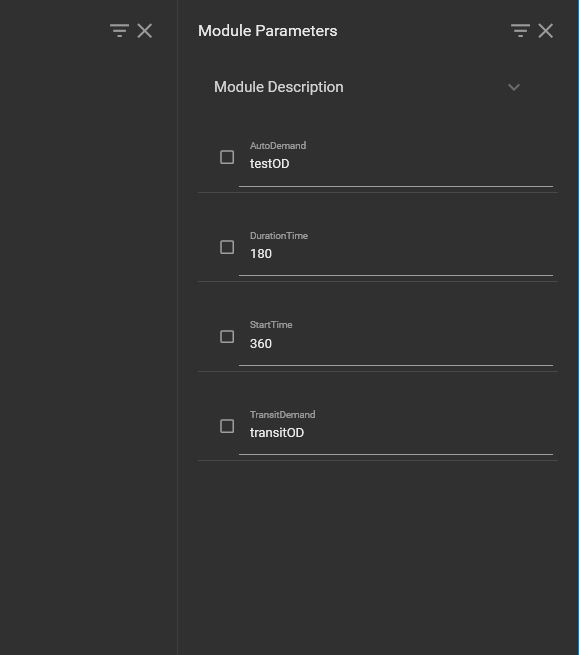

# Road Assignment

## Overview 

RoadAssignment tool creates the scenario and experiment simulation the user wishes to run. 

## Parameters

There are four user parameters the user has to input which are the following: 
* **AutoDemand**: String id of auto 
* **Duration**: Duration time in minutes
* **StartTime**: Start time in minutes
* **TransitDemand**: String id of transit

## In XTMF

As shown in Figure1 below, RoadAssignment has four input module parameters the user has to input.

<figure>
    
    <figcaption>Figure 1: RoadAssignment Module Parameters</figcaption>
</figure>
