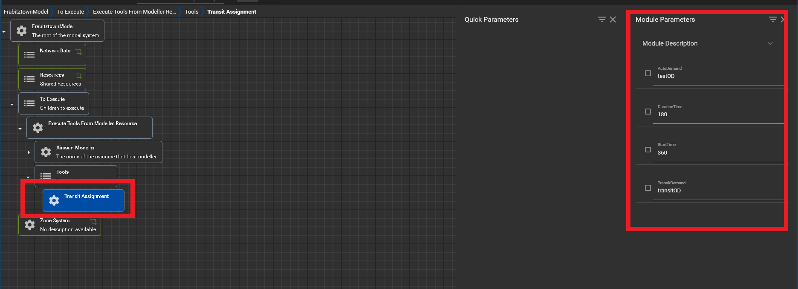

# Transit Assignment

## Overview 

TransitAssignment tool creates Public Transit (PT) scenario and runs the 
transit assignment. 

## Parameters

There are four user parameters the user has to input 
which are the following: 
* **AutoDemand**: String id of auto 
* **Duration**: Duration time in minutes
* **StartTime**: Start time in minutes
* **TransitDemand**: String id of transit

Note these are the same inputs as the Road Assignment tool.

## In XTMF

As shown in Figure1 below, TransitAssignment has four input module 
parameters the user has to input.

<figure>
    
    <figcaption>Figure 1: TransitAssignment Module Parameters</figcaption>
</figure>
