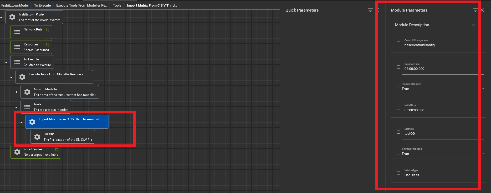

# ImportMatrixFromCSVThirdNormalized

## Overview 

The ImportMatrixFromCSVThirdNormalized tool is responsible for reading the 
OD (Origin-Destination) csv file and create an OD matrix to add to the network.  

## Parameters

ImportMatrixFromCSVThirdNormalized  has several input parameters and one
inner submodule. The parameters and modules are the following: 
* **ODCSV**: Inner submodule which is the file path to the location where 
the OD csv file is located.
* **CentroidConfiguration**: String name of the centroid. Default name is baseCentroidConfig.
* **DurationTime**: Time in minutes
* **InitialTime**: Initial time in minutes
* **IncludesHeader**: Boolean value if OD csv file has headers or not. Default is True
* **MatrixID**: String name of the matrixID 
* **ThirdNormalized**: Boolean value if the values are third normalized. Default is True
* **VehicleType**: String name of the type of vehicle. 

## In XTMF

As shown in the Figure 1 below, ImportMatrixFromCSVThirdNormalized 
contains one submodule called ODCSV highlighted with the bottom 
left red box which stores the filepath to the 
location of the OD CSV file. On the top right hand side is
where the user is responsible for pasting in the various user inputs.
As shown in the image below the values for each of the various inputs are
the following:
* **CentroidConfiguration**: baseCentroidConfig.
* **DurationTime**: 03:00:00:000
* **InitialTime**: 06:00:00:000
* **IncludesHeader**: True
* **MatrixID**: testOD
* **ThirdNormalized**: True
* **VehicleType**: Car Class  

<figure>
    
    <figcaption>Figure 1: ImportMatrixFromCSVThirdNormalized tool with submodules and 
                location of module paramters. 
    </figcaption>
</figure>

Figure 2 shows the header screenshot of the OD csv files. As shown
in the image below there are three columns the csv file contains: 
* Origin
* Destination
* Data

<figure>
    
    <figcaption>Figure 2: Screenshot of the OD csv to show sample data
    and headers. 
    </figcaption>
</figure>