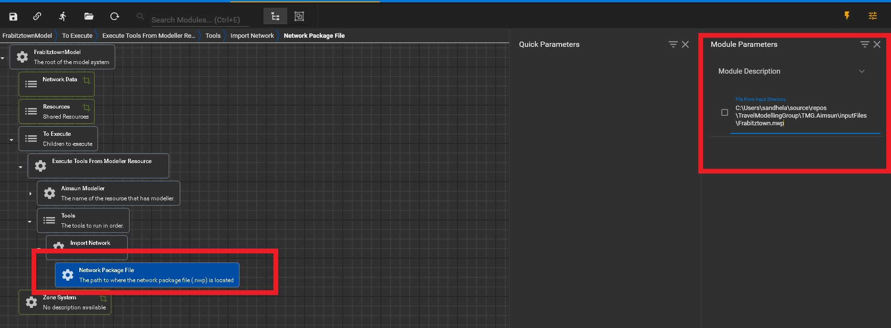

# ImportNetwork

## Overview 

ImportNetwork tool imports and uses a blank .ang file with the VDFS preconfigured.

## Parameters

There is only one parameter the user has to input which is the following:
* **Network Package File**: The file path to the location where the .nwp file is stored on your machine. 

## In XTMF
As shown in the Figure 1 below, ImportTransitNetwork contains one inner 
submodule called NetworkPackageFile highlighted with the bottom left red 
box.
On the right hand side we see the red box on the top right side 
of the page where user is responsbile for pasting in the 
file path to the network package file (.nwp). 

<figure>
    
    <figcaption>Figure 1: ImportNetwork Tool with submodules and 
                location of module paramters</figcaption>
</figure>