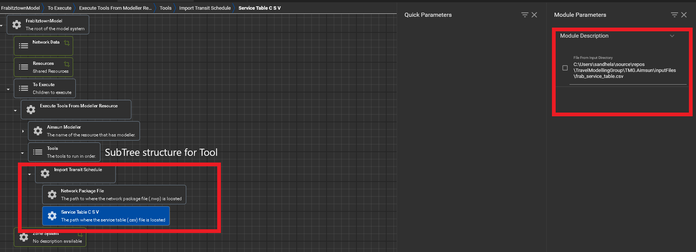

# ImportTransitSchedule

## Overview 

The ImportTransitSchedule tool is responsible for adding the transit schedule
across the transit lines previously added by the tool ImportTransitNetwork.

## Parameters

ImportTransitSchedule contains two inner submodules. The two inner submodules
are the following: 
* **Network Package File**: The file path to the location where the .nwp file is stored on your machine.
* **Service Table CSV**: The file path to the location where the service table csv file is located.

## In XTMF

As shown in the Figure 1 below, ImportTransitSchedule contains two submodules
highlighted with the bottom left red box. On the top right hand side is
where the user is responsible for pasting in the service table csv file
path. 

<figure>
    
    <figcaption>Figure 1: ImportTransitSchedule tool with submodules and 
                location of module paramters. 
    </figcaption>
</figure>

Figure 2 shows the header screenshot of the service table csv files. As shown
in the image below there are three columns the csv file contains 
* emmed_id
* trip deprature time labelled trip_depart
* trip arrival time labelled trip_arrive

<figure>
    
    <figcaption>Figure 2: Screenshot of service table csv to show sample data
    and headers. 
    </figcaption>
</figure>