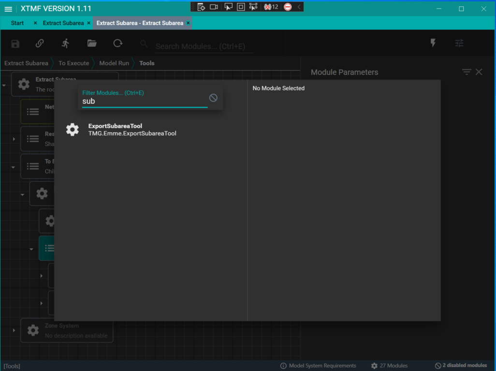
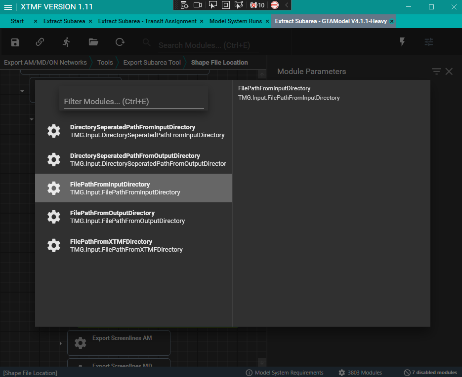
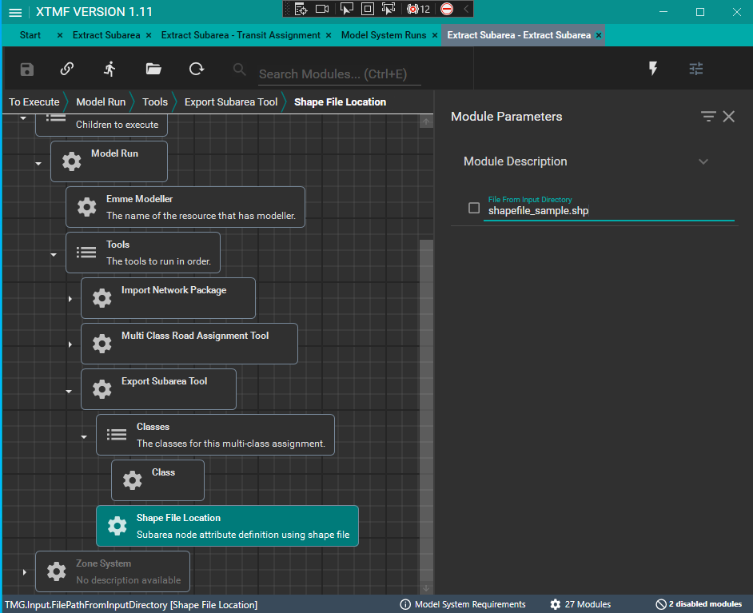
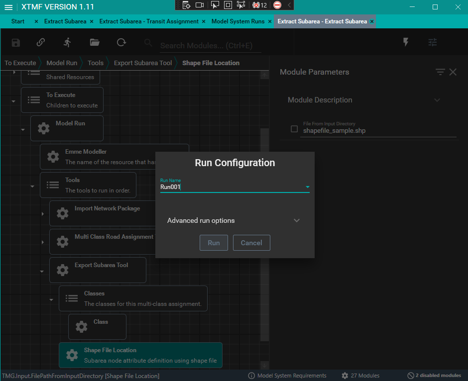
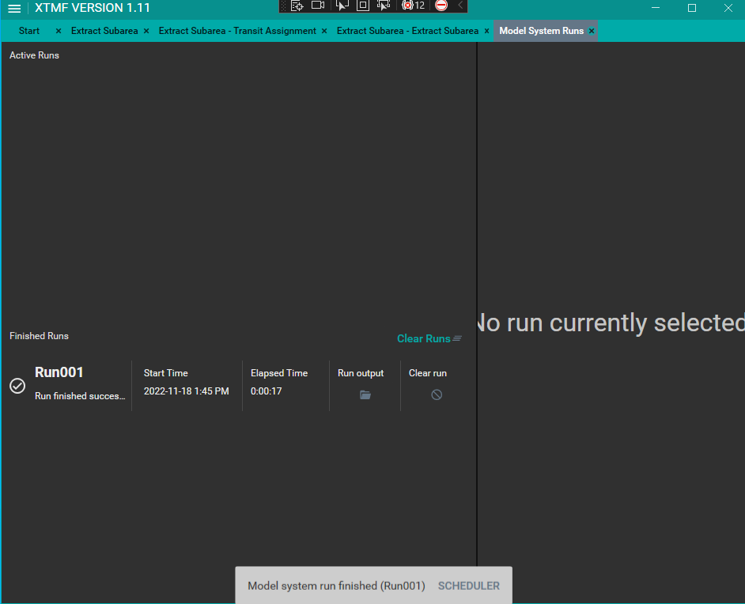
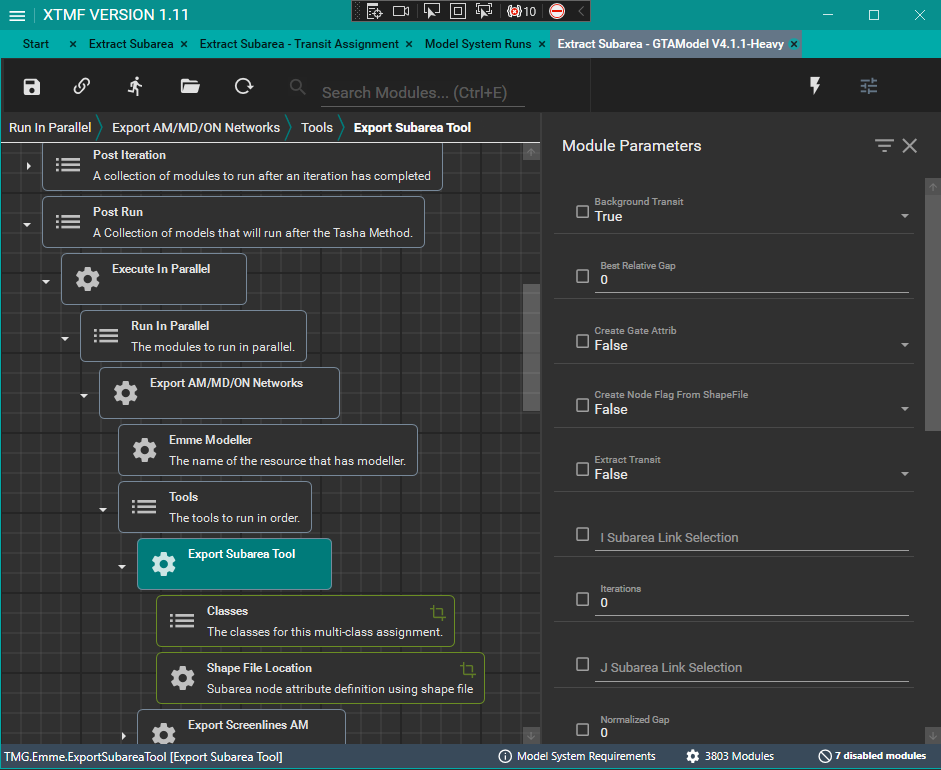

# **Add Export Subarea Tool to XTMF**

This tutorial shows how the subarea tool can be added to XTMF in general and also where to add it within the GTAModel setup in XTMF.

> [!NOTE]
 >  Adding Export Subarea Tool to XTMF requires XTMF 1.11+.

## **Tutorial - How to add the tool within XTMF**

Adding the `ExportSubareaTool` to XTMF GUI requires following the following step:

* Add the Export Subarea Tool Module to the Tools to execute or run in XTMF
* Enter all module parameters needed to run the tool. See module parameter explanation for "export subarea tool" below for more.
* Add all the class sub-module you want to run. You add as many as you want.
* Add sub-module parameter needed to run the tool. See sub-module parameter explanation for "Traffic Classes".
* Add shape file location sub-module and set the name of the shape file to use. This is required only if you want XTMF define a subarea based on a shapefile representing the subarea.
* Run model system

> [!NOTE]
The subarea tool can be added as many times (within as many classes as is needed)

Below contains details on how to add the tool to XTMF

#### **1. Add the Export Subarea Tool Module to the Tools to execute or run in XTMF**
<figure>
    
    <figcaption text-align="center">Figure 1: Add Module</figcaption>
</figure>

<figure>
    
    <figcaption>Figure 2: Search for and ExportSubareaTool</figcaption>
</figure>

#### **2. Enter all module parameters needed to run the tool.**
<figure>
    
    <figcaption align="center">Figure 3: Enter subarea module parameters</figcaption>
</figure>

#### **3. Enter all class sub-module you want to run. You can add as many as you want.**
<figure>
    
    <figcaption align="center">Figure 4: Add module (Ctrl + M) </figcaption>
</figure>

<figure>
    
    <figcaption align="center">Figure 5: Add class sub-module </figcaption>
</figure>

#### **4. Enter class sub-module parameters needed to run the tool.**
<figure>
    
    <figcaption align="center">Figure 6: Enter class module parameters</figcaption>
</figure>

#### **5. (Optional) Add shape file location sub-module and set the name of the shape file to use.**
<figure>
    
    <figcaption align="center">Figure 7: Add shape file sub-module</figcaption>
</figure>

<figure>
    
    <figcaption align="center">Figure 8: Enter shapefile name </figcaption>
</figure>

#### **6. Run model system**
<figure>
    
    <figcaption align="center">Figure 9: Run Model</figcaption>
</figure>

<figure>
    
    <figcaption align="center">Figure 10: Run Finished </figcaption>
</figure>

## **Tutorial - Adding Export Subarea Tool within a GTAModel System in XTMF**
The `ExportSubareaTool` can be added into a GTAModel model system under the post run.

<figure>
    
    <figcaption align="center">Figure 11: Adding Export Subarea Tool in GTAModel</figcaption>
</figure>

To set up the subarea tool with all its parameters within a GTAModel system, use the tutorial in the preceding section.