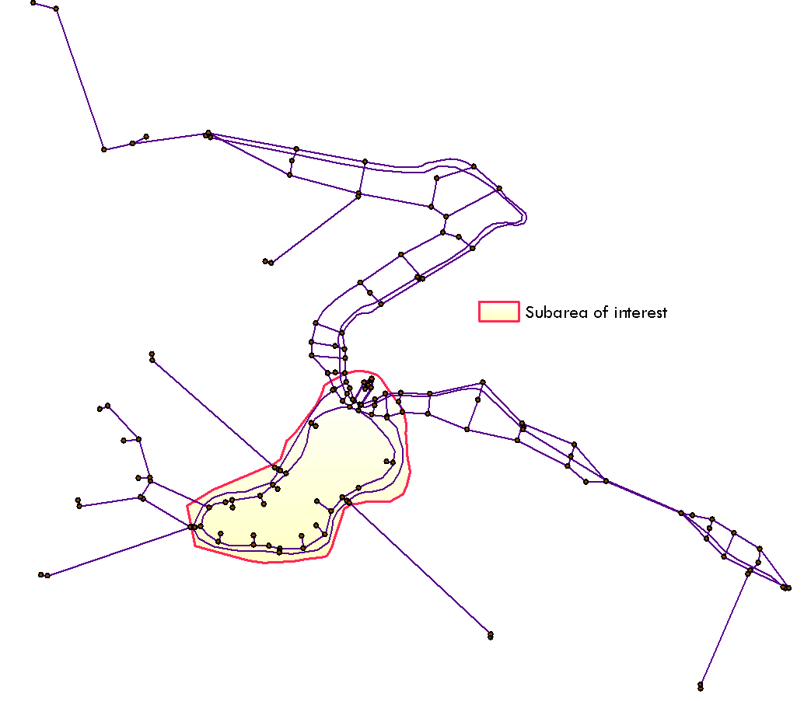
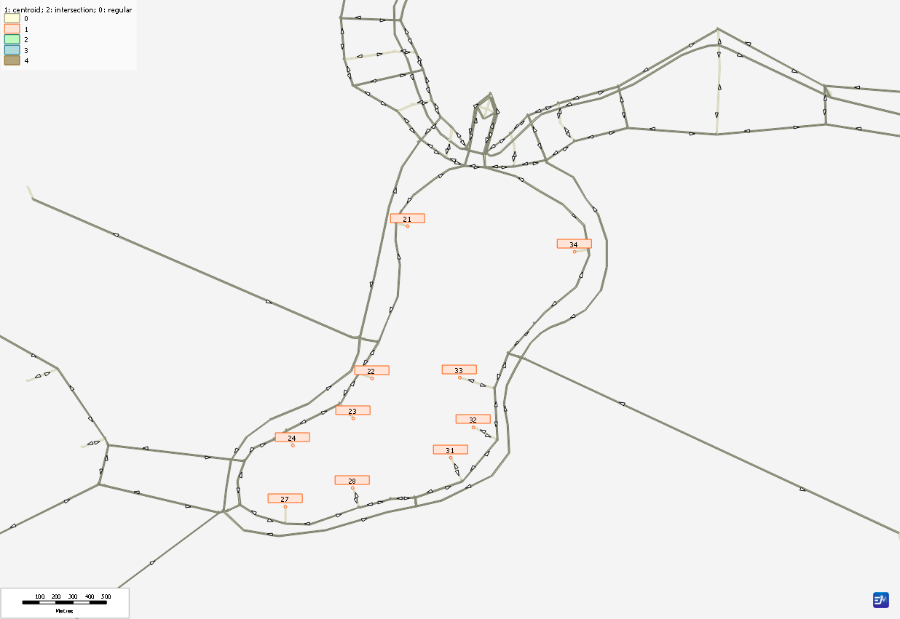

# **Export Subarea Tool**
The `ExportSubareaTool` is used to export the road network from a regional network, the `ExportSubareaTool` extracts the traversal demand matrices, link volumes, turn volumes, transit network (optional), and traffic and transit traversal demand matrices (optional). To learn more about the subarea network, visit the [TMG Export Subarea Tool Documentation](https://tmg.utoronto.ca/doc/2.0/tmgtoolbox2_emme/tools/Export/ExportSubareaNetwork.html).

In this workshop, we are going to learn how to use the TMG `ExportSubareaTool` to export a subarea from a regional network.


## **Download resources needed to complete this tutorial**

1. Regional Network (\*.NWP) file
    <ul>
        <li> [Frabitztown regional network package file](download/1.frabiztown.zip)</li>
    </ul>
    
2. Shapefile (\*.SHP) representing subarea to export
    <ul>
        <li> Polygon [Shapefile](download/2.frabiztown_shapefile.zip) of the subarea within Frabitztown</li>
    </ul>

3. TMGToolbox (\*.MTBX) files 
    <ul>
        <li> [Toolbox is compatible with EMME 4.6.0+](download/3b.TMGToolbox_MTBX_Python3.zip)</li>
        <li> [Toolbox is compatible with EMME 4.4.4.2](download/3a.TMGToolbox_MTBX.zip)</li>
    </ul>

4. Completed [XTMF Model System file(*.XML)](download/4.export_subarea_model_system.zip)

5. Sample [subarea output folder ](download/5.sample_output_folder.zip)


> [!NOTE]
 >  Adding Export Subarea Tool to XTMF requires XTMF 1.11+.

## **Set up XTMF or Emme Modeller**

The subarea tool can be added to the Emme Modeller or XTMF.
<ul>
    <li> [Export Subarea Tutorial](ExportSubarea.md) if you are using Emme notebook or </li>
    <li> [Add Export Subarea Tool to XTMF](AddSubareaTool2XTMF.md) if you are using XTMF</li>
</ul>

## **Frabitztown Regional Network**

In this workshop, we will be exporting a subarea road & transit network from the Frabitztown network.

<figure>
    
    <figcaption text-align="center">Figure 1: Frabitztown Regional Network</figcaption>
</figure>

### **Preparing inputs into the TMG Export Subarea tool**

**1. Define the node extra attribute (@nflag) used to hold the subarea definition**

<li> Before running the Export subarea tool we must identify the nodes of the subarea we want to export from the regional network. The extra attribute @nflag is set to 1 representing the subarea or 0 otherwise.
<li> If the regional network does not already have a node extra attribute defining the subarea, then there are various ways to define the subarea. 
<li> The TMGToolbox Export Subarea Tool provides an optional method to define the subarea within a network using polygon shape files. To do this, the TMG `ExportSubareaTool` create an extra node attribute (e.g. @nflag) from the polygon shapefile provided, and set it to either 0 or 1 to define the subarea.

<figure>
    
    <figcaption text-align="center">Figure 2: Subarea Polygon Shapefile within Frabitztown Network</figcaption>
</figure>

**2. Define link attribute (@gate) used to hold the gate information.**

<li> If the regional network does not have gate information defined, supplying all the centroid connections within the subarea as input parameters into the TMGToolbox Export Subarea Tool creates gate information for your network.</li>
<li> In this workshop, we will be setting the parameters i subarea link selection and j subarea link selection to all the centroid connections within the subarea. i.e. </li>

```python
    "i_subarea_link_selection": "i=21,24 or i=27,28 or i=31,34", 
    "j_subarea_link_selection": "j=21,24 or j=27,28 or j=31,34”
```

<figure>
    
    <figcaption text-align="center">Figure 3: Centroids within the subarea</figcaption>
</figure>


## **Start Coding**

### **Prepare Export Subarea tool JSON parameters**
So far we have prepared 
<ul>
    <li>The needed input files (network files, shapefiles, etc.)</li>
    <li> Identified all the centroid connections within our subarea to use for gate link selection</li>
</ul>
Now we are going to prepare the JSON parameters needed to successfully run the subarea tool. Below is a sample parameter script. Parameter explanation can be found in the [Export Subarea Tool Documentation](https://tmg.utoronto.ca/doc/1.6/tmgtoolbox/input_output/ExportSubareaTool.html)

```python

#parameters
scenario_number = "1"

#Import Network Package parameters
network_file = "test.nwp"
conflict_option = "OVERWRITE"
scenario_name = "Frabitztown"

# Import Binary Matrix parameters
matrix_type = 4
matrix_number = "10"
import_file =  "Test0.25.mtx"
matrix_description = "demand matrix"

# Export Subarea Tool parameters
modes = "c"
demand_matrix_id = "mf10"
time_matrix_id = "mf0"
cost_matrix_id = "mf0"
toll_matrix_id = "mf1"
peak_hour_factor = "1"
link_cost = "0"
toll_weight = "1"
iterations = 4
r_gap = 0
br_gap = 0
norm_gap = 0
shape_file_location = "frab_shape/frab_border.shp"
i_subarea_link_selection = "i"
j_subarea_link_selection = "j"
subarea_gate_attribute = "@gate"
subarea_node_attribute = "@nflag"
create_node_flag_from_shapefile = True
create_gate_attrib = True
extract_transit = True
output_folder = "Subarea5"
performance_flag = True
run_title = "road assignment"
link_toll_attribute_id = "@toll"
name_string = "traffic class 1"
result_attributes = "@auto_volume1"
background_transit = True
on_road_ttf_ranges = "3-128"
```

> [!CAUTION]
> **Export Subarea Tool parameters require editing:**
    <ul>
        <li> Follow the code along exercise to fix export subarea tool parameters.</li>
        <li> Frabitztown network does not have transit result stored.</li>
    </ul>

### **Add the TMGToolbox to Emme Modeller**
Follow this link to learn how to [add TMGToolbox to the Emme Modeller]().

### **Code Along Exercise**

Complete the following exercise to get the correct parameters above

1. Copy the above parameters into the EMME notebook
2. Edit the three Export Subarea Tool parameters above to match the following:

    ```python
        i_subarea_link_selection = "i=21,24 or i=27,28 or i=31,34"
        j_subarea_link_selection = "j=21,24 or j=27,28 or j=31,34"
        extract_transit = False 
    ```
3. Add the script below to the below the parameters and run script
    ```python
            
        import_matrix = m.tool("tmg.input_output.import_binary_matrix")
        import_network = m.tool("tmg.input_output.import_network_package")
        export_subarea_network = m.tool("tmg.input_output.export_subarea_tool")

        import_network(network_file, scenario_number, conflict_option)
        
        import_matrix(matrix_type, matrix_number,import_file,scenario_number,matrix_description)
        
        export_subarea_network(
            scenario_number,
            modes,
            demand_matrix_id,
            time_matrix_id,
            cost_matrix_id,
            toll_matrix_id,
            peak_hour_factor,
            link_cost,
            toll_weight,
            iterations,
            r_gap,
            br_gap,
            norm_gap,
            shape_file_location,
            i_subarea_link_selection,
            j_subarea_link_selection,
            subarea_gate_attribute,
            subarea_node_attribute,
            create_node_flag_from_shapefile,
            create_gate_attrib,
            extract_transit,
            output_folder,
            performance_flag,
            run_title,
            link_toll_attribute_id,
            name_string,
            result_attributes,
            background_transit,
            on_road_ttf_ranges,
        )
    ```
 > [!NOTE]
 > Running this tool within XTMF makes it much easier to manage. Learn more on how to set up the Export Subarea tool within XTMF/TMGToolbox and within a GTAModel System [here](https://tmg.utoronto.ca/doc/1.6/tmgtoolbox/input_output/ExportSubareaTool.html#tutorial---how-to-add-the-tool-within-xtmf).

 ### **Output - Export Subarea Tool**

 The tool outputs a folder that contains a new database containing only the network of the subarea. After loading the emmebank into Emme, the subarea of the Frabitztown regional network looks like


<figure>
    
    <figcaption text-align="center">Figure 4: Frabitztown Subarea Network</figcaption>
</figure>

Detailed analysis of the trips into and out of the Frabitztown subarea.
