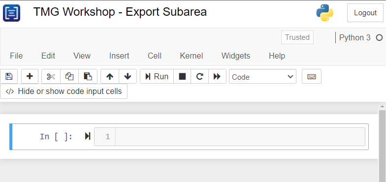

# **Add the toolbox to EMME**
The `ExportSubareaTool` is used to export the road network from a regional network, the `ExportSubareaTool` extracts the traversal demand matrices, link volumes, turn volumes, transit network (optional), and traffic and transit traversal demand matrices (optional). To learn more about the subarea network, visit the [TMG Export Subarea Tool Documentation](https://tmg.utoronto.ca/doc/2.0/tmgtoolbox2_emme/tools/Export/ExportSubareaNetwork.html).

In this workshop, we are going to learn how to use the TMG `ExportSubareaTool` to export a subarea from a regional network.

## **Add the toolbox to Emme Modeller**

a.	Open Emme modeller

<figure>
    
    <figcaption text-align="center">Figure 4: Modeller in Emme Tools</figcaption>
</figure>

b.	Click “Add a toolbox…”

 <figure>
    
    <figcaption text-align="center">Figure 5: Add Downloaded TMG Toolbox</figcaption>
</figure>

c.	Choose the .mtbx file path, enter a title and set the namespace to “tmg”
 
  <figure>
    
    <figcaption text-align="center">Figure 6: Set new toolbox file path, title and namespace </figcaption>
</figure>

d.	Check to confirm the toolbox has been added and close the modeller
 
 <figure>
    
    <figcaption text-align="center">Figure 7: Verify TMG Toolbox is added</figcaption>
</figure>

## **Launch Emme Notebook**

a. Launch EMME notebook
  <figure>
    
    <figcaption text-align="center">Figure 8: Launch EMME notebook </figcaption>
</figure>

b. Create a new Python notebook and rename

<figure>
    
    <figcaption text-align="center">Figure 8: Create and rename a new python EMME notebook </figcaption>
</figure>

c. You should get the below page (here we renamed to TMG Workshop – Export Subarea)
 
<figure>
    
    <figcaption text-align="center">Figure 8: EMME notebook ready for coding </figcaption>
</figure>

d. We are ready to start writing the subarea tool JSON parameters.