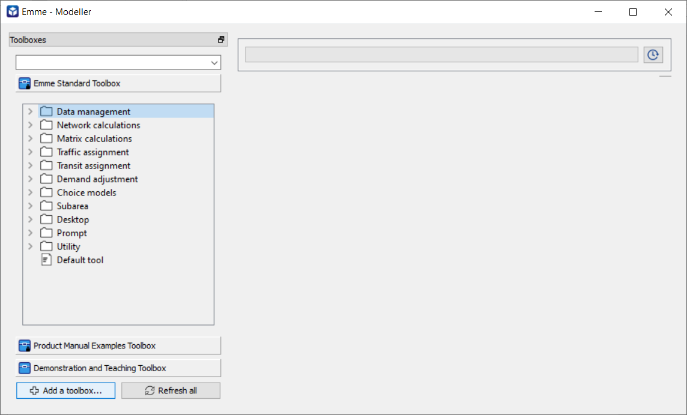
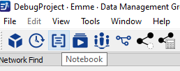

# **Export Subarea Tool**
The `ExportSubareaTool` is used to export the road network from a regional network, the `ExportSubareaTool` extracts the traversal demand matrices, link volumes, turn volumes, transit network (optional), and traffic and transit traversal demand matrices (optional). To learn more about the subarea network, visit the [TMG Export Subarea Tool Documentation](https://tmg.utoronto.ca/doc/2.0/tmgtoolbox2_emme/tools/Export/ExportSubareaNetwork.html).

In this workshop, we are going to learn how to use the TMG `ExportSubareaTool` to export a subarea from a regional network.

## **Download resources needed to complete this tutorial**

1. Regional Network (\*.NWP) file
  -  Frabitztown Network package [file](#)

2. Shapefile (\*.SHP) representing subarea to export
  - Polygon [Shapefile](#) of the subarea within Frabitztown

3. TMGToolbox (\*.MTBX) files 
  - [Toolbox is compatible with EMME 4.6.0+](#)
  - [Toolbox is compatible with EMME 4.4.4.2](#)


## **Frabitztown Regional Network**

In this workshop, we will be exporting a subarea road & transit network from the Frabitztown network.

<figure>
    
    <figcaption text-align="center">Figure 1: Frabitztown Regional Network</figcaption>
</figure>

### **Preparing inputs into the TMG Export Subarea tool**

**1. Define the node extra attribute (@nflag) used to hold the subarea definition**

- Before running the Export subarea tool we must identify the nodes of the subarea we want to export from the regional network. The extra attribute @nflag is set to 1 representing the subarea or 0 otherwise.
- If the regional network does not already have a node extra attribute defining the subarea, then there are various ways to define the subarea. 
- The TMGToolbox Export Subarea Tool provides an optional method to define the subarea within a network using polygon shape files. To do this, the TMG `ExportSubareaTool` create an extra node attribute (e.g. @nflag) from the polygon shapefile provided, and set it to either 0 or 1 to define the subarea.

<figure>
    
    <figcaption text-align="center">Figure 2: Subarea Polygon Shapefile within Frabitztown Network</figcaption>
</figure>

**2. Define link attribute (@gate) used to hold the gate information.**

- If the regional network does not have gate information defined, supplying all the centroid connections within the subarea as input parameters into the TMGToolbox Export Subarea Tool creates gate information for your network.
- In this workshop, we will be setting the parameters i subarea link selection and j subarea link selection to all the centroid connections within the subarea. i.e. 

```python
    "i_subarea_link_selection": "i=21,24 or i=27,28 or i=31,34", 
    "j_subarea_link_selection": "j=21,24 or j=27,28 or j=31,34”
```

<figure>
    
    <figcaption text-align="center">Figure 3: Centroids within the subarea</figcaption>
</figure>


## **Setting up EMME**

### **Add the toolbox to Emme Modeller**

a.	Open Emme modeller

<figure>
    
    <figcaption text-align="center">Figure 4: Modeller in Emme Tools</figcaption>
</figure>

b.	Click “Add a toolbox…”

 <figure>
    
    <figcaption text-align="center">Figure 5: Add Downloaded TMG Toolbox</figcaption>
</figure>

c.	Choose the .mtbx file path, enter a title and set the namespace to “tmg”
 
  <figure>
    
    <figcaption text-align="center">Figure 6: Set new toolbox file path, title and namespace </figcaption>
</figure>

d.	Check to confirm the toolbox has been added and close the modeller
 
 <figure>
    
    <figcaption text-align="center">Figure 7: Verify TMG Toolbox is added</figcaption>
</figure>

### **Launch Emme Notebook**

a. Launch EMME notebook
  <figure>
    
    <figcaption text-align="center">Figure 8: Launch EMME notebook </figcaption>
</figure>

b. Create a new Python notebook and rename

<figure>
    
    <figcaption text-align="center">Figure 8: Create and rename a new python EMME notebook </figcaption>
</figure>

c. You should get the below page (here we renamed to TMG Workshop – Export Subarea)
 
<figure>
    
    <figcaption text-align="center">Figure 8: EMME notebook ready for coding </figcaption>
</figure>

d. We are ready to start writing the subarea tool JSON parameters.

## **START CODING**

### **Prepare Export Subarea tool JSON parameters**
So far we have prepared 
- The needed input files (network files, shapefiles, etc.)
- Identified all the centroid connections within our subarea to use for gate link selection

Now we are going to prepare the JSON parameters needed to successfully run the subarea tool. Below is a sample parameter script. Parameter explanation can be found in the [Export Subarea Tool Documentation](https://tmg.utoronto.ca/doc/2.0/tmgtoolbox2_emme/tools/Export/ExportSubareaNetwork.html)

```python
parameters = {
    "extract_transit": True,
    "i_subarea_link_selection": "i=21,24 or i=27 or i=800000",
    "j_subarea_link_selection": "j=21,389 or j=27 or j=31,34",
    "scenario_number": 3,
    "shape_file_location": "TestFiles/subarea_border.shp",
    "subarea_output_folder": "TestFiles/Subarea",
    "create_nflag_from_shapefile": True,
    "create_gate_attribute": True,
    "subarea_node_attribute": "@nflag",
    "subarea_gate_attribute": "@gate",
    "background_transit": True,
    "br_gap": 0,
    "iterations": 4,
    "norm_gap": 0,
    "performance_flag": True,
    "r_gap": 0,
    "run_title": "road assignment",
    "sola_flag": True,
    "mixed_use_ttf_ranges": [{"start": 3, "stop": 128}],
    "traffic_classes": [
        {
            "name": "traffic class 1",
            "mode": "c",
            "demand_matrix": "mf10",
            "time_matrix": "mf0",
            "cost_matrix": "mf4",
            "toll_matrix": "mf0",
            "peak_hour_factor": 1,
            "volume_attribute": "@auto_volume1",
            "link_toll_attribute": " @toll",
            "toll_weight": 1,
            "link_cost": 0,
        }
    ],
}
```
### **Code Along Exercise**

Complete the following exercise to get the correct parameters above

1. Copy the above parameters into the EMME notebook
2. Set the parameters below to match the frabitztown network:
 - `i_subarea_link_selection to i=21,24 or i=27,28 or i=31,34`
 - `j_subarea_link_selection to j=21,24 or j=27,28 or j=31,34`
 - `shape_file_location`
 - `subarea_output_folder`
 - `extract_transit to False (because the Frabitztown network does not have transit result stored.)`


