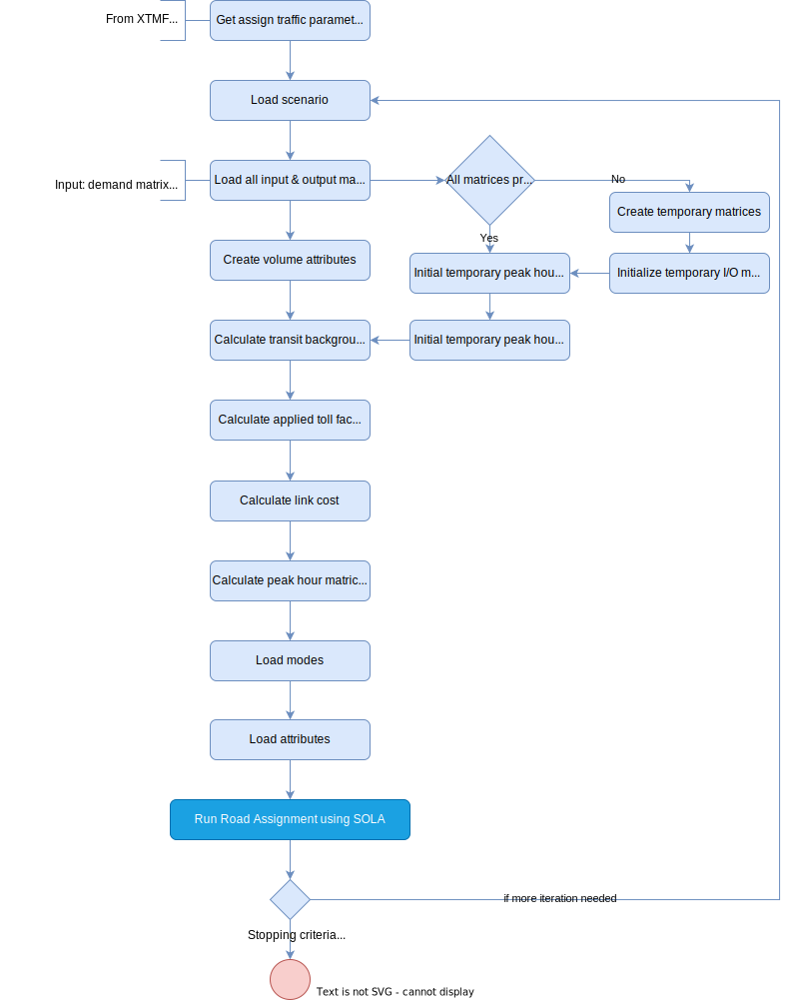

# **Assign Traffic**
> [!NOTE]
>This tool works with Emme version 4.5.1+, XTMF2, and produces results similar to the Multi Class Road Assignment tool in XTMF1/TMGToolbox1.

The Assign Traffic tool executes a multi-class road assignment which allows for the generalized penalty of road tolls. `AssignTraffic` is a toll-based road assignment tool.

Latest version of this tool includes the ability to:
  > * Increase resolution of analysis by adding link volume attributes
  > * Allow for multi-threaded matrix calculation in 4.2.1+
  > * Receive JSON object parameters from XTMF2
  > * Receive JSON file parameters from Python API call

## **Tool Flowchart**
To run the this tool, parameters can be provided by the modeller through the XTMF2 GUI or as python API call. The diagram below shows the flow of how the `AssignTraffic` tool works.
<figure>
    
    <figcaption>Figure 1: Assign Traffic Flowchart</figcaption>
</figure>


## **Using the Tool with Modeller**
`AssignTraffic` tool is not callable from Emme Modeller. It is intended and only to be called from XTMF2 or via a python API call.

The tool can be found in "TMG Toolbox 2" -> "Assign" -> "Assign Traffic". You can
find the code for this tool [here](https://github.com/TravelModellingGroup/TMG.EMME/blob/master/TMG.EMME/TMGToolbox2/src/Assign/assign_traffic.py).

## **Using the Tool with XTMF2**
> [!CAUTION]
> **NOTE TMG Modeller**: Update the location where Assign Traffic tool could be found when within the model system in XTMF2.

Using XTMF2 graphical user interface, parameters (defined below) needed to run the `AssignTraffic` tool can be set by the users. This tool is called `AssignTraffic`. In **XTMF2**, it is available to add within a model system under ***ExecuteToolsFromModellerResource*** or ***EmmeToolsToRun***.

## **Using the Tool from an External Python API Call**
You can call the `AssignTraffic` by calling the python API. Below is a script sample.

**Script Example**
```python
import AssignTraffic as assignTransit
parameters = {
    "background_transit": True,
    "br_gap": 0,
    "iterations": 100,
    "norm_gap": 0,
    "performance_flag": True,
    "r_gap": 0,
    "run_title": "road assignment",
    "scenario_number": 1,
    "sola_flag": True,
    "traffic_classes": [
        {
            "name": "traffic class 1",
            "mode": "c",
            "demand_matrix": "mf10",
            "time_matrix": "mf0",
            "cost_matrix": "mf4",
            "toll_matrix": "mf0",
            "peak_hour_factor": 1,
            "volume_attribute": "@auto_volume1",
            "link_toll_attribute": " @toll",
            "toll_weight": 1,
            "link_cost": 0,
            "path_analyses": [
                {
                    "attribute_id": "1",
                    "aggregation_matrix": "",
                    "aggregation_operator": "max",
                    "lower_bound": "7",
                    "upper_bound": "7",
                    "path_selection": "all",
                    "multiply_path_prop_by_demand": "7",
                    "multiply_path_prop_by_value": "7",
                    "analysis_attributes": "",
                    "analysis_attributes_matrix": "mf0",
                }
            ],
        }
    ],
}
assignTransit(parameters) 
```
### Module Parameter Explanation: "Assign Traffic"
|Parameter `type`|Explanation|
| :------------------- | :------------------- |
|Background Transit `boolean`|Set this to FALSE to not assign transit vehicles on the roads.|
|Best Relative Gap `float`|The minimum gap required to terminate the algorithm.| 
|Iterations `integer`|The maximum number of iterations to run.|
|Normalized Gap `float`|The minimum gap required to terminate the algorithm.|
|Performance Mode `boolean`|Set this to FALSE to leave a free core for other work, recommended leaving set to TRUE.|
|Relative Gap `float`|The minimum gap required to terminate the algorithm. |
|Run Title `string`|The name of the run to appear in the logbook|
|Scenario Number `integer`|The scenario number to execute against|
### Sub-Module Parameter Explanation:  "Traffic Classes"
|Parameter|Explanation|
| :------------------- | :------------------- |
|Cost Matrix `string`|The matrix number e.g. "mf4" to save the total cost into.|
|Demand Matrix `string`|The id of the demand matrix to use.|
|LinkCost `float`|The penalty in minutes per dollar to apply when traversing a link.|
|Mode `string`|The mode for this class.|
|Time Matrix `string`|The matrix number to save in vehicle travel times.|
|Toll Matrix `string`|The matrix to save the toll costs into.|
|Toll Weight `string`|to be updated.|
|TollAttributeID `string`|The attribute containing the road tolls for this class of vehicle.|
|VolumeAttribute `string`|The name of the attribute to save the volumes into (or None for no saving).|
|Peak Hour Factor `float`|A factor to apply to the demand in order to build a representative hour.|
### Sub-Module Parameter Explanation: "Traffic Classes -> Path Analysis"
|Parameter|Explanation|
| :------------------- | :------------------- |
|Aggregation Matrix `string`|The matrix number to store the results into.|
|Attribute ID `string`|The attribute to use for analysis.|
|Lower Bound for Path Selector `string`|The number to use for the lower bound in path selection, or None if using all paths|
|Multiply Path Proportion By Analyzed Demand `string`|Choose whether to multiply the path proportion by the analyzed demand.|
|Multiply Path Proportion By Path Value `string`|Choose whether to multiply the path proportion by the path value.|
|Operator `string`|The operator to use to aggregate the matrix. Example: '+' for emissions, 'max' for select link analysis. `Full list of operators that can be used: +, -, *, /, %, .max., .min.`|
|Paths to Select `string`|The paths that will be used for analysis.|
|Upper Bound for Path Selector `string`|The number to use for the upper bound in path selection, or None if using all paths.|
