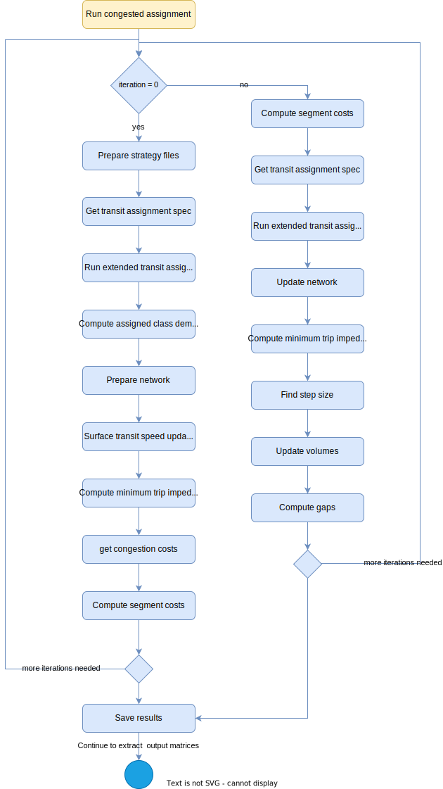

# **Assign Transit**
> [!NOTE]
>This tool works with Emme version 4.5.1+, XTMF2, and produces results similar to the TMG Transit Assignment Tool in XTMF1/TMGToolbox1.

The Assign Transit tool runs a multi-class transit assignment which executes a congested transit assignment procedure for the GTAModel V4.0. `AssignTransit` also allows for surface transit speed updating.

Hard-coded assumptions in the `AssignTransit` tool include:
  > * Boarding penalties are assumed stored in UT3. 
  > * The congestion term is stored in US3.
  > * All available transit modes are used.

## **Tool Flowchart**
To run the this tool, parameters can be provided by the modeller through the XTMF2 GUI or as python API call. The diagram below shows the flow of how the `AssignTransit` tool works.

<figure>
    
    <figcaption>Figure 1: Assign Transit Flowchart</figcaption>
</figure>

The diagram below expands on the assign transit flow that deals with the uncongested transit assignment.
<figure>
    
    <figcaption>Figure 2: Uncongested Transit Assignment Flowchart</figcaption>
</figure>

The diagram below expands on the assign transit flow that deals with the congested transit assignment.
<figure>
    
    <figcaption>Figure 3: Congested Transit Assignment Flowchart</figcaption>
</figure>

## **Using the Tool with Modeller**
`AssignTransit` tool is not callable from Emme Modeller. It is intended and only to be called from XTMF2 or via a python API call.

The tool can be found in "TMG Toolbox 2" -> "Assign" -> "Assign Transit". You can
find the code for this tool [here](https://github.com/TravelModellingGroup/TMG.EMME/blob/master/TMG.EMME/TMGToolbox2/src/Assign/assign_transit.py).

## **Using the Tool with XTMF2**
> [!CAUTION]
> **NOTE TMG Modeller**: Update (and delete this warning) the location where Assign Transit tool could be found when within the model system in XTMF2.

Using XTMF2 graphical user interface, parameters (defined below) needed to run the `AssignTransit` tool can be set by the users. This tool is called `AssignTransit`. In **XTMF2**, it is available to add within a model system under ***ExecuteToolsFromModellerResource*** or ***EmmeToolsToRun***.

## **Using the Tool from an External Python API Call**
You can call the `AssignTransit` by calling the python API. Below is a script sample.

**Script Example**
```python
import inro.modeller as _m
_MODELLER = _m.Modeller()
parameters = {
    "calculate_congested_ivtt_flag": True,
    "node_logit_scale": True,
    "effective_headway_attribute": "@ehdw1",
    "effective_headway_slope": 0.165,
    "headway_fraction_attribute": "@frac1",
    "iterations": 100,
    "norm_gap": 0,
    "rel_gap": 0,
    "scenario_number": 1,
    "walk_speed": 0,
    "transit_classes": [
        {
            "name": "transit_class_name",
            "board_penalty_matrix": "mf0",
            "board_penalty_perception": 1,
            "congestion_matrix": "mf0",
            "demand_matrix": "mf0",
            "fare_matrix": "mf0",
            "fare_perception": 35,
            "in_vehicle_time_matrix": "mf0",
            "impedance_matrix": "mf0",
            "link_fare_attribute_id": "@lfare",
            "mode": "*",
            "perceived_travel_time_matrix": "mf0",
            "segment_fare_attribute": "@sfare",
            "wait_time_perception": 0,
            "wait_time_matrix": "mf0",
            "walk_time_perception_attribute": "@walkp",
            "walk_time_matrix": "mf0",
            "walk_perceptions": [
                {
                    "filter": "i=10000,20000 or j=1...7000,98000",
                    "walk_perception_value": 1.8,
                }
            ],
        }
    ],
    "surface_transit_speeds": [
        {
            "alighting_duration": 1.1219,
            "boarding_duration": 1.9577,
            "default_duration": 7.4331,
            "global_erow_speed": 35,
            "line_filter_expression": "",
            "mode_filter_expression": "b",
            "transit_auto_correlation": 1.612,
        }
    ],
    "ttf_definitions": [
        {"congestion_exponent": 5.972385, "congestion_perception": 1, "ttf": 1},
        {"congestion_exponent": 6.72, "congestion_perception": 2, "ttf": 2}
    ],
    "congestion_exponent": "",
    "assignment_period": 0,
    "name_string": "",
    "congested_assignment": True,
    "csvfile": "",
    "origin_distribution_logit_scale": 0,
    "walk_distribution_logit_scale": 3,
    "surface_transit_speed": True,
    "walk_all_way_flag": False,
    "xrow_ttf_range": "",
}
assign_transit = _MODELLER.tool("tmg2.Assign.assign_transit")
assign_transit(parameters)
```

### Module Parameter Explanation: "Assign Transit"

|Parameter `type`|Explanation|
| :----------------------------- | :---------------------------------------------- |
|Calculate Congested Ivtt Flag `bool` | Set to TRUE to extract the congestion matrix and add its weighted value to the in vehicle time (IVTT) matrix.|
|Node Logit Scale `float` | This is the scale parameter for the logit model at critical nodes. Set it to 1 to turn it off logit. Set it to 0 to ensure equal proportion on all connected auxiliary transfer links. Critical nodes are defined as the non centroid end of centroid connectors and nodes that have transit lines from more than one agency|
|Effective Headway Attribute Id `string` | The name of the attribute to use for the effective headway|
|Effective Headway Slope `float` | Effective Headway Slope|
|Headway Fraction Attribute Id `string` | The ID of the NODE extra attribute in which to store headway fraction. Should have a default value of 0.5.|
|Iterations `integer` |Convergence criterion: The maximum number of iterations performed by the transit assignment.|
|Normalized Gap `float` | Convergence criterion |
|Relative Gap `float` | Convergence criterion|
|Scenario Number `integer` | Emme Scenario Number to execute against|
|Walk Speed `float` | Walking speed in km/hr. Applied to all walk (aux. transit) modes in the Emme scenario.|
|Assignment Period `float` | A multiplier applied to the demand matrix to scale it to match the transit line capacity period. This is similar to the peak hour factor used in auto assignment.|
| Congested Assignment `bool` | Set this to false in order to not apply congestion during assignment.|
| CSV File `string` | A link to the csv file that will specify iterational information|
| Origin Distribution Logit Scale `float`| Scale parameter for logit model at origin connectors. |
| Surface Transit Speed `bool` | Set to TRUE to allow surface transit speed to be used in the assignment |
|Walk All Way Flag `bool` |Set to TRUE to allow walk all way in the assignment|
| Xrow TTF Range `string` | Set this to the TTF, TTFs or range of TTFs (separated by commas) that represent going in an exclusive right of way. This is for use in STSU |
| Transit Classes `list` | The classes for this multi-class assignment. |
| Surface Transit Speed Model `list`| Surface Transit Speed Model. |
| TTF Definitions `string` | The TTF's to apply in the assignment. |
| Transit Class `string` | The classes for this multi-class assignment. |

### Sub-Module Parameter Explanation: "Transit Classes"

| Parameter `type`| Explanation |
| :----------------------------- | :---------------------------------------------- |
| Demand Matrix `string` | The ID of the full matrix containing transit demand ODs. |
| Board Penalty Matrix `string`| The ID of the FULL matrix in which to save the applied boarding penalties.  Enter mf0 to skip this matrix.|
| Board Penalty Perception `float`| Perception factor applied to boarding penalty component. |
| Congestion Matrix `string`     | The ID of the FULL matrix in which to save transit congestion. Enter mf0 to skip saving this matrix |
| Fare Matrix `string`     | The ID of the FULL matrix in which to save transit fares. Enter mf0 to skip saving this matrix|
| Fare Perception `float`     |Perception factor applied to path transit fares, in $/hr. |
| InVehicle Time Matrix `string`     | The ID of the FULL matrix in which to save in-vehicle travel time. Enter mf0 to skip saving this matrix|
| Impedance Matrix `string`     | The ID of the FULL matrix in which to save the impedance.Enter mf0 to skip saving this matrix|
| Link Fare Attribute Id `string`     | The ID of the LINK extra attribute containing actual fare costs.|
| Mode `string`     | A character array of all the modes applied to this class. \'*\' selects all.|
| Perceived Travel Time Matrix `string`     | The ID of the FULL matrix in which to save the incurred penalties. Enter mf0 to skip saving this matrix|
| Segment Fare Attribute Id `string`     |The ID of the SEGMENT extra attribute containing actual fare costs. |
| Wait Time Perception `flaot`     | Perception factor applied to wait time component.|
| Wait Time Matrix `string`     |The ID of the FULL matrix in which to save total waiting time. Enter mf0 to skip saving this matrix |
| Walk Time Perception Attribute Id `string`     |The ID of the LINK extra attribute in which to store walk time perception. Should have a default value of 1.0. |
| Walk Time Matrix `string`     | The ID of the FULL matrix in which to save total walk time. Enter mf0 to skip saving this matrix|
| Walk Perceptions `list`     | Contains the walk perception values fo this multi-class assignment|

### Sub-Module Parameter Explanation: "TTF Definitions"

| Parameter `type`| Explanation |
| :----------------------------- | :---------------------------------------------- |
| TTF `integer` | The TTF number to assign to. 1 would mean TTF1. |
| Congestion Exponent `float`| The congestion exponent to apply to this TTF.   |
| Congestion Perception `integer`| The congestion perception to apply to this TTF. |

### Sub-Module Parameter Explanation: "Surface Transit Speed Model"

| Parameter `type`| Explanation  |
| :----------------------------- | :---------------------------------------------- |
| Alighting Duration `float` | The alighting duration in seconds per passenger to apply.|
| Boarding Duration `float` | The boarding duration in seconds per passenger to apply. |
| Default Duration `float` | The default duration in seconds per stop to apply.       |
| Global EROW Speed `float` | The speed to use in segments that have Exclusive Right of Way for transit and do not have @erow_speed defined. Note that the speed includes acceleration and deceleration time. |
| Line Filter Expression `string` | The line filter that will be used to determine which lines will get surface transit speed applied to them. To select all lines, leave this and the line filter blank|
| Mode Filter Expression `string`| The modes that will get surface transit speed updating applied to them. To select all lines, leave this and the line filter blank|
| Transit Auto Correlation `float`| The multiplier to auto time to use to find transit time.|
