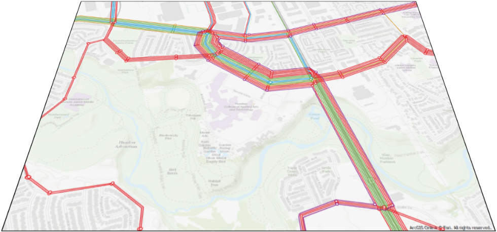
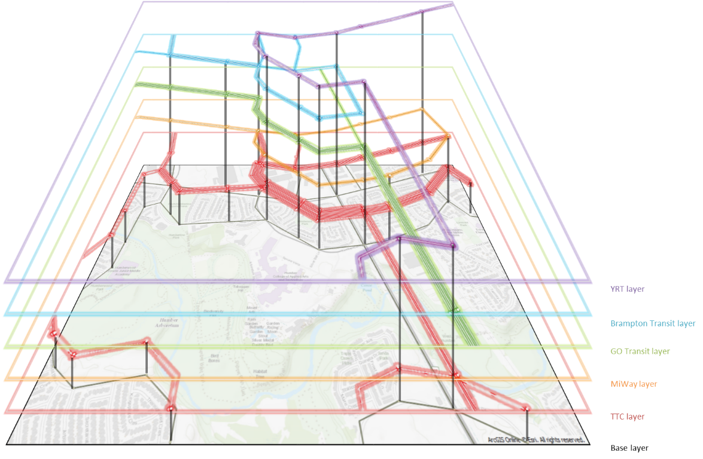

# **Generate Hypernetwork From Schema**
> [!NOTE]
>This tool works with Emme version 4.5.1+, XTMF2, and produces results similar to the TMG FBTN From Schema Multiclass Tool in XTMF1/TMGToolbox1.

The Generate Hypernetwork From Schema tool generates a hyper-network to support fare-based transit assignment (FBTA) for at least one fare class, from an XML schema file. `GenerateHypernetworkFromSchema` reports to the logbook links and segments with negative fare values for further inspection. Please consult the [TMG fare schema specification documentation](http://tmg.utoronto.ca/doc/1.6/gtamodel/user_guide/file_formats/fare_schema_file_specification.html). 

Temporary storage requirements for `GenerateHypernetworkFromSchema`: 
> * One transit line extra attribute, 
> * One node extra attribute. 

## Hyper Network Generation Procedure

The concept of a hyper network is that each agency has its own “layer” of virtual links and nodes, which are only connected to the base network by auxiliary transit (walk) links that contain the transit fare cost.

The map below shows base layer of a transport network.
<figure>
    
    <figcaption>Figure 1: Base Network Layer without Transit Layers</figcaption>
</figure>

In this implementation, this has been generalized to have each transit line belong to a “group” (instead of a hard-coded operator), in order to give the procedure more flexibility. The groups are specified using a fare schema file (see next section for details). The main assumption of this approach is that transfers between lines within the same group are free (unless a boarding cost is applied during assignment). To generate the appropriate hyper-network, six steps are followed:
1.	Transit lines are classified into groups based on the fare schema file.
2.	The network is pre-processed. The procedure attaches to each node two sets of data: groups which are stopping at the node, and groups which are passing through the node. The two sets are mutually exclusive. Two groups of (non-zone) nodes are identified:
a.	Road (or Surface) nodes are connected to at least one link with the auto mode.
b.	Transit (or Station) nodes are connected to links with only transit or walk modes. 
3.	Surface nodes are processed first. For each group using a surface node (either stopping at or passing through), a new virtual node is created. The base node’s attributes are copied over. For groups stopping at the node, the associated virtual node is connected using walk links to the base node and to each other. These walk links are indexed for later use .
4.	The same procedure is followed for station nodes, except that virtual nodes are only created when two or more groups use the station node . This is done as station nodes already exist in their own layer in the network (e.g. subway links and nodes), and therefore do not need to “moved” over to a new layer. Any existing connected walk links are indexed appropriately.
5.	Virtual surface nodes and virtual station nodes are connected to each other using walk links.
6.	Finally, each transit line is moved over to its appropriate layer in the hyper network. In-vehicle links are created between virtual nodes when none exist. The image below shows an 3D layer representing how the Hyper Network would look like in a pictorial representation.

<figure>
    
    <figcaption>Figure 2: Example 3D Hyper Network showing Generated Transit Layers</figcaption>
</figure>

It should be noted that, currently, no effort is made to make the network look visually appealing. Virtual nodes are given the exact same coordinates as their base node, and virtual links copy the same shape as their base links. Therefore, the created hyper-network appears to be identical to the base network – since the virtual nodes and links overlap the base precisely.

## **Using the Tool with Modeller**
`GenerateHypernetworkFromSchema` tool is not callable from Emme Modeller. It is intended and only to be called from XTMF2 or via a python API call.

The tool can be found in "TMG Toolbox 2" -> "Generate" -> "Generate Hypernetwork From Schema". You can
find the code for this tool [here](https://github.com/TravelModellingGroup/TMG.EMME/blob/master/TMG.EMME/TMGToolbox2/src/Generate/generate_hypernetwork_from_schema.py).

## **Using the Tool with XTMF2**
> [!CAUTION]
> **NOTE TMG Modeller**: Update (and delete this warning) the location where Generate Hypernetwork From Schema tool could be found when within the model system in XTMF2.

Using XTMF2 graphical user interface, parameters (defined below) needed to run the `GenerateHypernetworkFromSchema` tool can be set by the users. This tool is called `GenerateHypernetworkFromSchema`. In **XTMF2**, it is available to add within a model system under ***ExecuteToolsFromModellerResource*** or ***EmmeToolsToRun***.

## **Using the Tool from an External Python API Call**
You can call the `GenerateHypernetworkFromSchema` by calling the python API. Below is a script sample.

**Script Example**
```python
import inro.modeller as _m
_MODELLER = _m.Modeller()
parameters = {
    "base_scenario": 1,
    "new_scenario": 2,
	"new_scenario_title": "new_scenario_name",
    "station_connector_flag": True,
    "transfer_mode": "t",
    "virtual_node_domain": 100000,
    "base_schema_file": "TestFiles/base_fares.xml",
    "fare_classes": [
        {"link_fare_attribute": "@lfare", "segment_fare_attribute": "@sfare", "schema_file": "TestFiles/fares.xml"}
    ],
}
assign_transit = _MODELLER.tool("tmg2.Assign.assign_transit")
assign_transit(parameters)
```

### Module Parameter Explanation: "Generate Hypernetwork From Schema"

|Parameter `type`|Explanation|
| :----------------------------- | :---------------------------------------------- |
|Base Scenario `integer` | The number of the Emme BASE (i.e. non-FBTN-enabled) scenario|
|New Scenario `integer` | The number of the EMME scenario where Hypernetwork will be created|
|New Scenario Title `string` | The title of the EMME scenario where Hypernetwork will be created|
|Station Connector Flag `boolean` | Should centroid connectors be automatically integrated with stations?|
|Transfer Mode `string` | The mode ID to assign to new virtual connector links|
|Virtual Node Domain `integer` | All created virtual nodes will have IDs higher than this number. This will not override an existing node|
|Base Schema File `string` | XML Base Schema File|

### Sub-Module Parameter Explanation: "Fare Classes"
| Parameter `type`| Explanation  |
| :----------------------------- | :---------------------------------------------- |
|Link Fare Attribute `string` | A LINK extra attribute in which to store the transfer and boarding fares|
|Segment Fare Attribute `string` | A TRANSIT SEGMENT extra attribute in which to store the in-line fares|
|Schema File `string` | XML Fare Schema File|