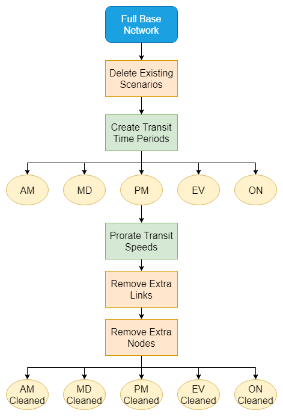

# **Generate Time Period Networks**
> [!NOTE]
>This tool works with Emme version 4.6.0+, XTMF2, and produces results similar to the TMG Full Network Set Generator Tool in XTMF1/TMGToolbox1.

The Generate Time Period Networks tool generates a cleaned base network for all time periods (AM, MD, PM, EV,and ON) modelled in a GTAModel run. The `GenerateTimePeriodNetworks` tool takes in a base network with zones and generates a full set of usable cleaned time period networks. The goal is that this tool will replace the standard TMG workflow from base to time period networks.

This tool depends on a number of input files whose content depends on the network characteristics to be modelled.

Input file requirements for `GenerateTimePeriodNetworks` tool: 
> * Transit Service Table File 
> * Transit Aggregation Selection Table File
> * Batch Edit File
> * Additional Transit Alternative Table Files
More on this can found in the parameters explanation below.

## Time Period Networks Generation Algorithm

The diagram below expands on the Time Period Networks Generation flow. It begins with creating transit time periods, then the transit speeds are prorated, and finally extra links and nodes are removed.

<figure>
    
    <figcaption>Figure 1: Generate Time Period Networks flow</figcaption>
</figure>


### Create Transit Time Period

`Create Transit Time Period`generates new scenarios for different time periods and uses a service table (a list of trips times) to generate headways and speeds for transit lines in each of those periods. Currently, this tool is run five separate times. 

### Prorate Transit Speed

The next is `Prorate Transit Speed`. This function takes the overall transit line speeds and apportions speeds to individual transit segments (stored in *us1*) based on the link free flow speed (*ul2*).

### Remove Extra Links

The `Remove Extra Links` function cleans the network of unnecessary or detrimental links. This is done in several steps:

* Links which have no transit lines but only transit modes are deleted.
* Non-connector dead-end links are removed.
* Links with transfer modes that do not connect two stations, or connect a station to the road network are deleted. Links of this nature which have other, non-transfer modes are not deleted; however, the transfer modes are removed from these links. Retaining transfer modes on these links can result in agents being able to bypass paying a fare in the hyper network.


### Remove Extra Nodes

Finally, the `Remove Extra Nodes` function “cleans” the network of all cosmetic nodes. For example, a node that does not connect to a centroid connector, is not an intersection and is not a transit stop will be removed. Using extra attributes, the set of nodes to be removed can be expanded to allow for removal of, for example, certain transit stops. This tool is necessary in order to allow for a hyper network to be generated that does not exceed the node limit.


## **Using the Tool with Modeller**
`GenerateTimePeriodNetworks` tool is not callable from Emme Modeller. It is intended and only to be called from XTMF2 or via a python API call.

The tool can be found in "TMG Toolbox 2" -> "Generate" -> "Generate Time Period Networks". You can
find the code for this tool [here](https://github.com/TravelModellingGroup/TMG.EMME/blob/master/TMG.EMME/TMGToolbox2/src/Generate/generate_time_period_networks.py).

## **Using the Tool with XTMF2**
> [!CAUTION]
> **NOTE TMG Modeller**: Update (and delete this warning) the location where Generate Time Period Networks tool could be found when within the model system in XTMF2.

Using XTMF2 graphical user interface, parameters (defined below) needed to run the `GenerateTimePeriodNetworks` tool can be set by the users. This tool is called `GenerateTimePeriodNetworks`. In **XTMF2**, it is available to add within a model system under ***ExecuteToolsFromModellerResource*** or ***EmmeToolsToRun***.

## **Using the Tool from an External Python API Call**
You can call the `GenerateTimePeriodNetworks` by calling the python API. Below is a script sample.

**Script Example**
```python
import inro.modeller as _m
_MODELLER = _m.Modeller()
parameters = {
    "base_scenario_number": 1,
    "transit_service_table_file": "Service Table.csv",
    "batch_edit_file": "Batch Line Edit.csv",
    "transit_aggregation_selection_table_file": "Aggregation.csv",
    "transit_alternative_table_file": "Alt File.csv",
    "attribute_aggregator": "vdf: force,length: sum,type: first,lanes: force,ul1: avg,ul2: force,ul3: force,dwt: sum,dwfac: force,ttf: force,us1: avg_by_length,us2: avg,us3: avg,ui1: avg,ui2: avg,ui3: avg,@stop: avg,@lkcap: avg,@lkspd: avg,@stn1: force,@stn2: force,@z407: avg",
    "connector_filter_attribute": "None",
    "default_aggregation": "Naive",
    "line_filter_expression": "line=______ xor line=TS____ xor line=GT____ xor line=T9____ xor line=T601__",
    "node_filter_attribute": "None",
    "stop_filter_attribute": "@stop",
    "transfer_mode_string": "tuy",
    "unposted_speed_limit":50,
    "time_periods": [
        {
            "name": "PM",
            "uncleaned_scenario_number": 30,
            "cleaned_scenario_number": 31,
            "uncleaned_description": "PM - Uncleaned Network",
            "cleaned_description": "PM - Cleaned Network",
            "start_time": "15:00",
            "end_time": "19:00",
            "scenario_network_update_file": "",
        },
        {
            "name": "EV",
            "uncleaned_scenario_number": 40,
            "cleaned_scenario_number": 41,
            "uncleaned_description": "EV - Uncleaned Network",
            "cleaned_description": "EV - Cleaned Network",
            "start_time": "19:00",
            "end_time": "24:00",
            "scenario_network_update_file": "",
        },
    ],
    "additional_transit_alternative_table": [{"name": "alt_file_1", "alternative_table_file": ""}],
}
generate_time_period_networks = _MODELLER.tool("tmg2.Generate.generate_time_period_networks")
generate_time_period_networks(parameters)
```

### Module Parameter Explanation: "Generate Time Period Networks"

|Parameter `type`|Explanation|
| :----------------------------- | :---------------------------------------------- |
|Base Scenario `integer` |The scenario number for the base network.|
|Transit Service Table File `string` |A link to the file containing transit service data. The service table should be organized with the following header: `emme_id, trip_depart, and trip_arrive`|
|Attribute Aggregator `string` |The formatted string to aggregate attributes. 'vdf: force, <br/> length: sum, <br/> type: first, <br/> lanes: avg, <br/> ul1: avg, <br/> ul2: force, <br/> ul3: avg, <br/> dwt: sum, <br/> dwfac: force, <br/> ttf: force, <br/> us1: avg_by_length, <br/> us2: avg, <br/> us3: avg, <br/> ui1: avg, <br/> ui2: avg, <br/> ui3: avg'|'vdf: force, <br/> length: sum, <br/> type: first, <br/> lanes: force, <br/> ul1: avg, <br/> ul2: force, <br/> ul3: force, <br/> dwt: sum, <br/> dwfac: force, <br/> ttf: force, <br/> us1: avg_by_length, <br/> us2: avg, <br/> us3: avg, <br/> ui1: avg, <br/> ui2: avg, <br/> ui3: avg, <br/> @stn1: force, <br/> @stn2: force'|Choose which functions to apply to attributes when combining affected links. Will apply *avg* to all extra attributes if not specified.|
|Connector Filter Attribute `string` |The name of the attribute to use as a filter. Use set to "None" if not available|
|Default Aggregation `string` | set to either `Agg`or `naïve` The name of the attribute to use as a filter.Specifies which aggregation type to use for lines NOT listed in `Agg Type Selection File`.|
|Line Filter Expression `string` |The formatted string to use as an expression to filter lines. Leave blank to skip prorating transit speeds. e.g. `'line=______ xor line=TS____ xor line=GT____'` The transit lines to apply applies this filter by default tool to all transit lines except for TTC subways and GO trains due to hand-coded *us1* values.|
|Node Filter Attribute ID `string` |Extra attribute used to change the selection of nodes. By default, all nodes will be accepted.|
|Stop Filter Attribute ID `string` |Extra attribute used to change the selection of transit stops. By default, all stops will be accepted. Recommended to use `@stop` (all nodes value = 1) to allow for removal of some transit stops, otherwise node limit will be exceeded in hyper network.|
|Transfer Mode String `string` |Modes used to transfer between transit stops, or to transit stops. <br/> Default list contains three modes: `t` Transfer between two transit lines for the same transit agency, `u` Transfer between two different transit agencies, `y` Walk between park & ride lot and a transit station.|
|Batch Edit File `string` |A path to the batch edit file.|
|Transit Aggregation Selection Table File `string` |This file specifies, for each line, what type of aggregation to use – naïve or average. `Naïve` sums up all trips in a time period and divides by the time period length; `Average` averages all headways throughout the period. The aggregation type selection file should be organized with the following header: `emme_id and agg_type`|
|Transit Alternative Table `string` |A link to the file containing how to modify transit schedules.|
|Unposted Speed Limit `integer` |Unposted Speed Limit in km/h|

### Sub-Module Parameter Explanation: "Time Periods"
| Parameter `type`| Explanation  |
| :----------------------------- | :---------------------------------------------- |
|Uncleaned Scenario Number `integer` |The scenario number for the uncleaned network|
|Uncleaned Description `string` |The description for the uncleaned scenario|
|Cleaned Scenario Number `integer` |The scenario number for the cleaned network|
|Cleaned Description `string` |The description for the cleaned scenario|
|Start Time `integer` |The start time for this scenario. Start of the time period. User integer time, e.g., 2:30PM should be 1430.|
|End Time `integer` |The end time for this scenario. End of the time period. User integer time, e.g., 2:30PM should be 1430.|
|Scenario Network Update File `string` |The location of the network update file for this time period.|

### Sub-Module Parameter Explanation: "Additional Transit Alternative Tables"
| Parameter `type`| Explanation  |
| :----------------------------- | :---------------------------------------------- |
|Additional Alternative Table File `string` |Additional Alternative Table File|
