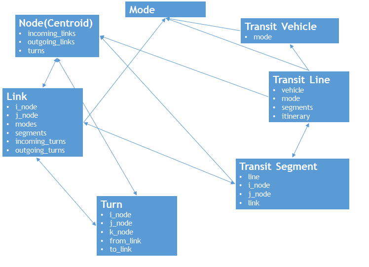

# EMME Class Structure

This section will go over some of EMME's classes and walk through.
We will load in order each object so we can start writing our custom script that can access an EMME network.
While not this is not the complete documentation this will give
you a foothold to go through INRO's documentation.  You can find the full modeller documentation in the
"Emme APU Reference".

<figure>
    
    <figcaption text-align="center">Figure 1: Finding EMME's Documentation</figcaption>
</figure>

## Loading the Network

To get access to an EMME network you will first need to get access to modeller, the databank, load a scenario,
and then read in the network.

### Getting Access to Modeller

> [!Note]
> If you are not writing this script from within EMME's Jupyter Notebook
> you will need to add the following line before the rest of your script <br/>
> `import inro.modeller`

Modeller is going to be the starting point for interacting with EMME.

```python
m = inro.modeller.Modeller()
```

### Acessing the Databank

Our next step after getting access to modeller is loading a databank.  The following example
shows how you can access the active databank:

```python
databank = m.emmebank
```

### Loading a scenario

The following code loads scenario 1 from the databank:

```python
scenario = databank.scenario(1)
```

### Loading a Network

The next line of code will load the network belonging to the scenario.  This
network will be an in-RAM copy of the network, **changes made to it will not
be saved to the scenario**.

```python
network = scenario.get_network()
```

To save changes to the network you will need to use the scenario's `publish_network` function:

```python
scenario.publish_network(network)
```

## Network Objects

Now that we have our network loaded into memory we have everything we need to start manipulating the network.

<figure>
    
    <figcaption text-align="center">Figure 2: EMME Network Components</figcaption>
</figure>


## Next Steps

Now that we have an understanding of how EMME's classes are related we are ready to start
[Writing A Script](WritingAScript.md).
