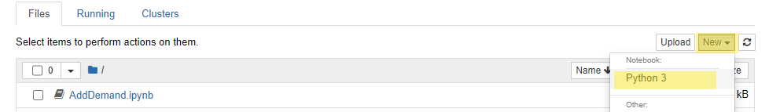

# Launching Notebook

In this step of the tutorial we will walk through how to launch
EMME's Jupyter Notebook.

## Steps

1. Launch EMME Desktop
1. Open the EMME Project you want to script with
1. Click on the `Notebook` menu item

    <figure>
        
        <figcaption text-align="center">Figure 1: Launch Notebook</figcaption>
    </figure>

1. Create New Notebook
    <figure>
        
        <figcaption text-align="center">Figure 2: Create New Notebook</figcaption>
    </figure>

    If you are running a version of EMME 4.4.5.1 or before this will say "Python 2".
1. Wait for EMME Services to finish loading
    

## Next Steps

Now that we have created our Jupyter Notebook we can now move onto learning some [Basic Python](BasicPython.md).  If
you are already familiar with Python you can instead skip to learning [EMME's class structure](EMMEClassStructure.md).
